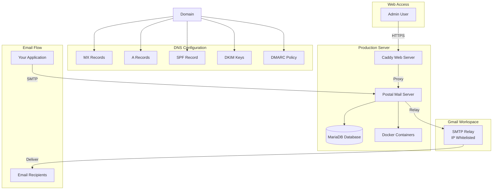
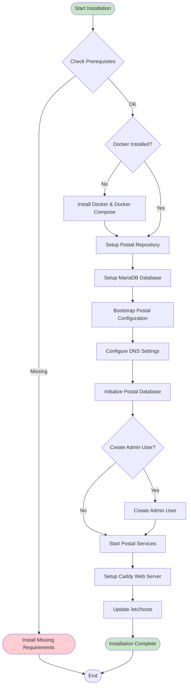
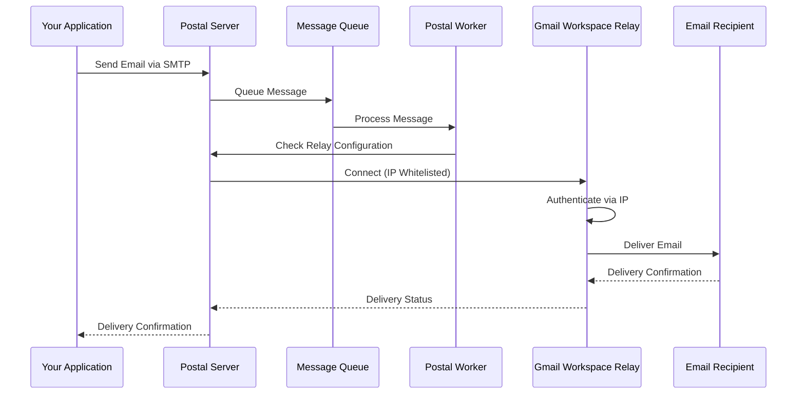

# Postal Installation Guide - Production

This guide covers installing and configuring Postal mail server for production use with Gmail Workspace.

## Prerequisites

Before installing Postal, ensure you have:

1. **Domain Name**: A registered domain name (e.g., `mail.yourdomain.com`)
2. **DNS Access**: Ability to configure DNS records for your domain
3. **Gmail Workspace Account**: A Google Workspace account with SMTP relay access
4. **Server Requirements**:
   - **Ubuntu 20.04+ or Debian 11+** (recommended)
   - **Rocky Linux 8+ or 9+** (also supported)
   - Minimum 2GB RAM, 4GB recommended
   - 20GB+ free disk space
   - Root/sudo access
5. **Network**: Ports 25, 80, 443, 5000 should be available

## Architecture Overview



## Installation Process



## Step-by-Step Installation

### Step 1: Run Installation Script

```bash
uv run --with typer --with rich --with pyyaml \
  src/gishant_scripts/postal/install_postal.py main \
  --domain "mail.yourdomain.com" \
  --db-password "secure-db-password" \
  --admin-email "admin@yourdomain.com" \
  --admin-password "secure-admin-password"
```

**Parameters:**
- `--domain`: Your mail server domain (e.g., `mail.yourdomain.com`)
- `--db-password`: Password for MariaDB database
- `--admin-email`: Email address for the admin user
- `--admin-password`: Password for the admin user
- `--skip-user-creation`: Skip admin user creation (if user already exists)

### Step 2: DNS Configuration

After installation, configure the following DNS records:

#### MX Record
```
Type: MX
Name: @ (or your mail subdomain)
Priority: 10
Value: mail.yourdomain.com
```

#### A Record
```
Type: A
Name: mail
Value: <your-server-ip>
TTL: 3600
```

#### SPF Record
```
Type: TXT
Name: @
Value: v=spf1 mx a:mail.yourdomain.com ~all
```

#### DKIM Record
Get DKIM keys from Postal web UI:
1. Log in to Postal web interface
2. Navigate to your mail server settings
3. Copy the DKIM public key
4. Add as TXT record:
```
Type: TXT
Name: postal._domainkey
Value: <dkim-public-key-from-postal>
```

#### DMARC Record
```
Type: TXT
Name: _dmarc
Value: v=DMARC1; p=quarantine; rua=mailto:admin@yourdomain.com
```

### Step 3: Configure Gmail Workspace SMTP Relay

For production, use Gmail Workspace SMTP relay with IP whitelisting:

1. **Get Your Server's Public IP**:
   ```bash
   curl -4 ifconfig.me
   ```

2. **Whitelist Your Server IP in Google Admin Console**:
   - Log in to Google Admin Console: https://admin.google.com
   - Navigate to: **Apps** → **Google Workspace** → **Gmail** → **Routing**
   - Scroll to **"SMTP relay service"** section
   - Click **"Configure"** or **"Add Another Rule"**
   - **Rule name**: Enter descriptive name (e.g., "Postal Mail Server")
   - **Allowed senders**: Select **"Only addresses in my domains"** (recommended)
   - **Authentication**:
     - ✅ Check **"Only accept mail from the specified IP addresses"**
     - Add your server's public IP address
   - **Encryption**: ✅ Check **"Require TLS Encryption"**
   - **Save** the rule
   - **Note**: Changes may take up to 24 hours to propagate (usually faster)

3. **Add SMTP Relay to Postal**:
```bash
uv run --with typer --with rich --with pyyaml \
  src/gishant_scripts/postal/install_postal.py add-relay \
  --host "smtp-relay.gmail.com" \
  --port 587 \
  --ssl-mode "StartTLS"
```

**Note**: Gmail Workspace SMTP relay does not require authentication when IP is whitelisted.

### Step 4: Setup TLS Certificates

For production, you should use proper TLS certificates:

```bash
uv run --with typer --with rich --with pyyaml \
  src/gishant_scripts/postal/install_postal.py setup-tls \
  --cert-path "/path/to/your/certificate.crt" \
  --key-path "/path/to/your/private.key"
```

Alternatively, Caddy will automatically obtain Let's Encrypt certificates if:
- Your domain DNS is properly configured
- Port 80 and 443 are accessible
- Caddy can verify domain ownership

### Step 5: Verify Installation

1. **Check Postal Status**:
```bash
sudo postal status
```

2. **Check Configuration**:
```bash
uv run --with typer --with rich --with pyyaml \
  src/gishant_scripts/postal/install_postal.py show-config
```

3. **Test Relay Connectivity**:
```bash
uv run --with typer --with rich --with pyyaml \
  src/gishant_scripts/postal/install_postal.py test-relay \
  --host "smtp-relay.gmail.com" \
  --port 587
```

4. **Access Web UI**:
   - Navigate to `https://mail.yourdomain.com`
   - Log in with admin credentials
   - Accept self-signed certificate (if using Caddy auto-cert)

## Email Delivery Flow



## Configuration Details

### Postal Configuration File

Location: `/opt/postal/config/postal.yml`

Key settings:
```yaml
version: 2
postal:
  web_server:
    bind_address: 127.0.0.1
    port: 5000
  smtp_server:
    port: 25
  smtp_client:
    tls_mode: opportunistic
  smtp_relays:
    - "smtp://smtp-relay.gmail.com:587?ssl_mode=starttls"
```

### Caddy Configuration

Location: `/opt/postal/config/Caddyfile`

Caddy handles:
- TLS termination
- Automatic certificate management
- Reverse proxy to Postal web interface

## Firewall Configuration

### Ubuntu/Debian (ufw)

```bash
sudo ufw allow 25/tcp
sudo ufw allow 80/tcp
sudo ufw allow 443/tcp
sudo ufw allow 5000/tcp
sudo ufw reload
```

### Rocky Linux (firewalld)

```bash
sudo firewall-cmd --zone=public --permanent --add-service=http
sudo firewall-cmd --zone=public --permanent --add-service=https
sudo firewall-cmd --zone=public --permanent --add-port=25/tcp
sudo firewall-cmd --zone=public --permanent --add-port=5000/tcp
sudo firewall-cmd --reload
```

## Troubleshooting

### Issue: Cannot Access Web UI

**Symptoms**: Connection refused or timeout

**Solutions**:
1. Check if Caddy is running: `sudo systemctl status caddy`
2. Verify port 443 is open: `sudo netstat -tlnp | grep 443`
3. Check Caddy logs: `sudo journalctl -u caddy -f`
4. Verify DNS resolution: `nslookup mail.yourdomain.com`

### Issue: Emails Not Delivering

**Symptoms**: Emails stuck in queue, delivery failures

**Solutions**:
1. Check Postal worker logs: `docker logs postal-worker-1 --tail 50`
2. Verify SMTP relay connectivity: Use `test-relay` command
3. Check DNS records: Verify MX, SPF, DKIM records
4. Verify IP whitelisting in Gmail Workspace
5. Check suppression list: Emails may be suppressed due to previous failures

### Issue: Database Connection Errors

**Symptoms**: Postal cannot connect to MariaDB

**Solutions**:
1. Check MariaDB status: `sudo systemctl status mariadb`
2. Verify database credentials in `postal.yml`
3. Check database connection: `sudo postal console` then `Server.first`
4. Restart services: `sudo postal restart`

## Maintenance

### Updating Postal

```bash
cd /opt/postal
sudo git pull
sudo postal restart
```

### Backup Database

```bash
sudo mysqldump -u postal -p postal > postal_backup_$(date +%Y%m%d).sql
```

### View Logs

```bash
# Postal logs
docker logs postal-web-1 --tail 100
docker logs postal-worker-1 --tail 100

# Caddy logs
sudo journalctl -u caddy -f

# System logs
sudo journalctl -xe
```

## Security Considerations

1. **Firewall**: Only expose necessary ports (25, 80, 443)
2. **TLS**: Always use TLS for SMTP connections
3. **Passwords**: Use strong, unique passwords for database and admin
4. **Updates**: Keep Postal and system packages updated
5. **Monitoring**: Set up monitoring for service health
6. **Backups**: Regularly backup database and configuration

## Next Steps

After installation:
1. Create an organization in Postal web UI
2. Create a mail server for your domain
3. Generate SMTP credentials for your application
4. Configure SPF, DKIM, and DMARC records
5. Test email delivery
6. Set up monitoring and alerting

For complete production workflow, see [Production Workflow Guide](PRODUCTION_WORKFLOW.md).
