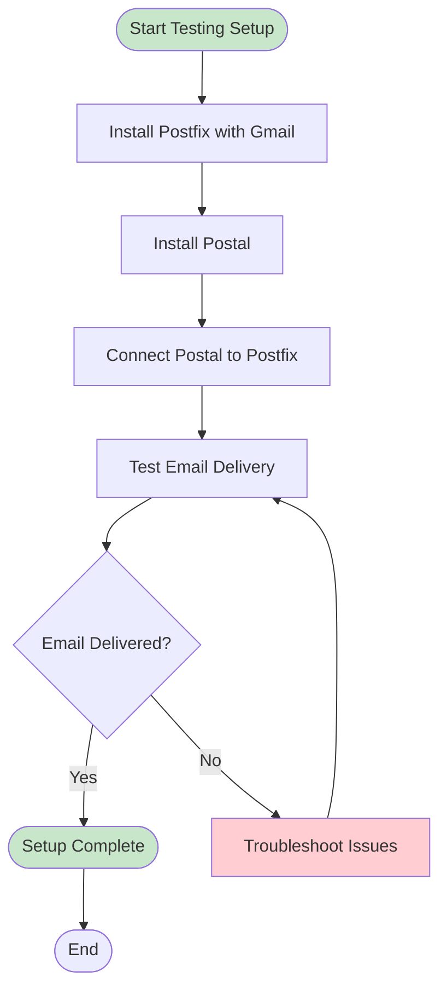
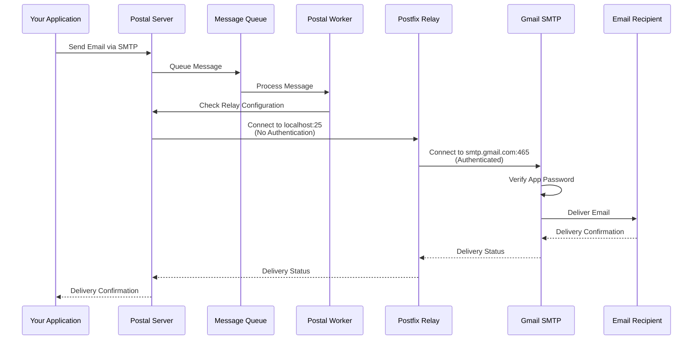

# Postal Installation Guide - Testing

This guide covers installing and configuring Postal mail server for local development and testing with personal Gmail via Postfix.

## Prerequisites

Before installing Postal for testing, ensure you have:

1. **Domain Name**: A domain or subdomain for testing (can use `postal.example.com` for local testing)
2. **Personal Gmail Account**: A Gmail account with 2FA enabled
3. **Gmail App Password**: A 16-character app password generated from Google Account settings
4. **Server Requirements**:
   - **Ubuntu 20.04+ or Debian 11+** (recommended)
   - **Rocky Linux 8+ or 9+** (also supported)
   - Minimum 2GB RAM
   - 10GB+ free disk space
   - Root/sudo access
5. **Network**: Ports 25, 80, 443, 5000 should be available

## Architecture Overview

```mermaid
graph TB
    subgraph "Local Testing Server"
        Postal[Postal Mail Server]
        Postfix[Postfix Relay]
        Caddy[Caddy Web Server]
        MariaDB[(MariaDB Database)]
    end

    subgraph "Local Configuration"
        HostsFile[/etc/hosts<br/>postal.example.com]
    end

    subgraph "Gmail Personal"
        PersonalGmail[Personal Gmail SMTP<br/>smtp.gmail.com:465]
        AppPassword[App Password<br/>Authentication]
    end

    subgraph "Email Flow"
        App[Your Application] -->|SMTP| Postal
        Postal -->|localhost:25<br/>No Auth| Postfix
        Postfix -->|Authenticated<br/>Port 465| PersonalGmail
        PersonalGmail -->|Deliver| Recipient[Email Recipients]
    end

    subgraph "Web Access"
        User[Admin User] -->|HTTPS| Caddy
        Caddy -->|Proxy| Postal
    end

    Postal --> MariaDB
    HostsFile -.->|Local DNS| Postal

    classDef local fill:#e8f5e9,stroke:#2e7d32;
    classDef external fill:#fff3e0,stroke:#f57c00;
```

## Why Postfix is Required

Postal's `smtp_relays` does **not** support authenticated external SMTP relays. For personal Gmail (which requires authentication), you need Postfix as an intermediary:

- **Postal** → `localhost:25` (Postfix, no authentication needed)
- **Postfix** → `smtp.gmail.com:465` (Gmail, authenticated with app password)

## Installation Process



## Step-by-Step Installation

### Step 1: Install Postfix with Gmail Configuration

First, install and configure Postfix to relay through your personal Gmail:

```bash
uv run --with typer --with rich \
  src/gishant_scripts/postal/install_postfix.py main \
  --gmail-address "your.email@gmail.com" \
  --app-password "your-16-char-app-password" \
  --relay-host "smtp.gmail.com" \
  --relay-port 465
```

**Parameters:**
- `--gmail-address`: Your Gmail email address
- `--app-password`: Gmail app password (16 characters, spaces are OK)
- `--relay-host`: Gmail SMTP hostname (default: `smtp.gmail.com`)
- `--relay-port`: Port 465 (SMTPS) or 587 (STARTTLS) - default: 465
- `--test-recipient`: Optional email to send test email

**Generate Gmail App Password:**
1. Go to https://myaccount.google.com/security
2. Enable 2-Step Verification (if not already enabled)
3. Go to https://myaccount.google.com/apppasswords
4. Generate a new app password for "Mail"
5. Copy the 16-character password (spaces can be included)

### Step 2: Verify Postfix Installation

```bash
# Check Postfix status
uv run --with typer --with rich \
  src/gishant_scripts/postal/install_postfix.py status

# Send test email
uv run --with typer --with rich \
  src/gishant_scripts/postal/install_postfix.py test \
  --recipient "your.email@gmail.com"
```

### Step 3: Install Postal

```bash
uv run --with typer --with rich --with pyyaml \
  src/gishant_scripts/postal/install_postal.py main \
  --domain "postal.example.com" \
  --db-password "postal" \
  --admin-email "admin@example.com" \
  --admin-password "admin123"
```

**Note**: For local testing, you can use `postal.example.com` as the domain. The script will automatically add it to `/etc/hosts`.

### Step 4: Connect Postal to Postfix

Configure Postal to use the local Postfix relay:

```bash
uv run --with typer --with rich --with pyyaml \
  src/gishant_scripts/postal/install_postal.py add-postfix-relay
```

This command:
- Checks if Postfix is running
- Tests connectivity to Postfix
- Adds `smtp://127.0.0.1:25?ssl_mode=none` to Postal configuration
- Restarts Postal

### Step 5: Minimal DNS Configuration (Optional)

For local testing, DNS configuration is minimal:

1. **Update `/etc/hosts`** (automatically done by script):
```
127.0.0.1 postal.example.com
```

2. **For External Access** (if needed):
   - Add A record pointing to your server IP
   - Add MX record (optional for testing)

**Note**: SPF, DKIM, and DMARC are not required for basic testing, but emails may be marked as spam.

### Step 6: Verify Complete Setup

1. **Check Postal Configuration**:
```bash
uv run --with typer --with rich --with pyyaml \
  src/gishant_scripts/postal/install_postal.py show-config
```

2. **Check Postfix Configuration**:
```bash
uv run --with typer --with rich \
  src/gishant_scripts/postal/install_postfix.py show-config
```

3. **Test Email Sending**:
```bash
uv run --with typer --with rich --with requests \
  src/gishant_scripts/postal/send_test_email.py smtp \
  --host "postal.example.com" \
  --port 25 \
  --username "postal-smtp" \
  --password "your-postal-smtp-password" \
  --sender "your.email@gmail.com" \
  --recipient "your.email@gmail.com"
```

## Email Delivery Flow



## Configuration Details

### Postal Configuration

Location: `/opt/postal/config/postal.yml`

Key settings for testing:
```yaml
version: 2
postal:
  web_server:
    bind_address: 127.0.0.1
    port: 5000
  smtp_server:
    port: 25
  smtp_relays:
    - "smtp://127.0.0.1:25?ssl_mode=none"
```

### Postfix Configuration

Location: `/etc/postfix/main.cf`

Key settings:
```ini
relayhost = [smtp.gmail.com]:465
smtp_use_tls = yes
smtp_sasl_auth_enable = yes
smtp_sasl_password_maps = hash:/etc/postfix/sasl_passwd
smtp_tls_wrappermode = yes
smtp_tls_security_level = encrypt
```

SASL Password File: `/etc/postfix/sasl_passwd` (secured with 600 permissions)

## Troubleshooting

### Issue: Postfix Authentication Fails

**Symptoms**: Emails stuck in Postfix queue, authentication errors

**Solutions**:
1. Verify app password is correct (16 characters)
2. Check SASL password file: `sudo cat /etc/postfix/sasl_passwd`
3. Recreate password map: `sudo postmap /etc/postfix/sasl_passwd`
4. Restart Postfix: `sudo systemctl restart postfix`
5. Check Postfix logs: `sudo tail -f /var/log/mail.log`

### Issue: Postal Cannot Connect to Postfix

**Symptoms**: "No SMTP servers were available" errors

**Solutions**:
1. Verify Postfix is running: `sudo systemctl status postfix`
2. Test connectivity: `telnet 127.0.0.1 25`
3. Check if relay is configured: `install_postal.py show-config`
4. Verify Postfix is listening: `sudo netstat -tlnp | grep 25`

### Issue: Emails Marked as Spam

**Symptoms**: Emails delivered but end up in spam folder

**Solutions**:
1. This is expected for testing without proper DNS setup
2. Check recipient's spam folder
3. For better deliverability, configure SPF, DKIM, and DMARC records
4. Use a proper domain instead of `postal.example.com`

### Issue: Suppression List Blocking Emails

**Symptoms**: Emails not sending, "recipient is on suppression list"

**Solutions**:
1. Access Postal console: `sudo postal console`
2. Remove from suppression list:
```ruby
server = Server.first
server.message_db.suppression_list.remove("recipient", "email@example.com")
```

## Testing Scenarios

### Test 1: Basic Email Delivery

```bash
# Send test email through Postal
uv run --with typer --with rich --with requests \
  src/gishant_scripts/postal/send_test_email.py smtp \
  --host "postal.example.com" \
  --port 25 \
  --username "postal-smtp" \
  --password "your-password" \
  --sender "your.email@gmail.com" \
  --recipient "your.email@gmail.com" \
  --subject "Test Email" \
  --body "This is a test email from Postal"
```

### Test 2: Verify Postfix Relay

```bash
# Test Postfix directly
echo "Test email body" | mail -s "Test Subject" your.email@gmail.com
```

### Test 3: Check Logs

```bash
# Postal worker logs
docker logs postal-worker-1 --tail 50

# Postfix logs
sudo tail -f /var/log/mail.log

# Postal web logs
docker logs postal-web-1 --tail 50
```

## Limitations of Testing Setup

1. **No Proper DNS**: Emails may be marked as spam
2. **Personal Gmail Limits**: Gmail has daily sending limits (500 emails/day for free accounts)
3. **No SPF/DKIM**: Without proper DNS, email authentication fails
4. **Local Domain**: Using `postal.example.com` is only for local testing

## Next Steps

After successful testing:
1. Set up proper domain and DNS records
2. Configure SPF, DKIM, and DMARC
3. Consider using Gmail Workspace for production
4. See [Testing Workflow Guide](TESTING_WORKFLOW.md) for complete workflow
5. See [Production Installation Guide](POSTAL_INSTALL_PRODUCTION.md) for production setup

## Quick Reference

```bash
# Install Postfix
uv run src/gishant_scripts/postal/install_postfix.py main \
  --gmail-address "your.email@gmail.com" \
  --app-password "your-app-password"

# Install Postal
uv run src/gishant_scripts/postal/install_postal.py main \
  --domain "postal.example.com" \
  --db-password "postal" \
  --admin-email "admin@example.com" \
  --admin-password "admin123"

# Connect Postal to Postfix
uv run src/gishant_scripts/postal/install_postal.py add-postfix-relay

# Check status
uv run src/gishant_scripts/postal/install_postal.py show-config
uv run src/gishant_scripts/postal/install_postfix.py status

# Send test email
uv run src/gishant_scripts/postal/send_test_email.py smtp \
  --host "postal.example.com" \
  --port 25 \
  --username "postal-smtp" \
  --password "your-password" \
  --sender "your.email@gmail.com" \
  --recipient "your.email@gmail.com"
```
