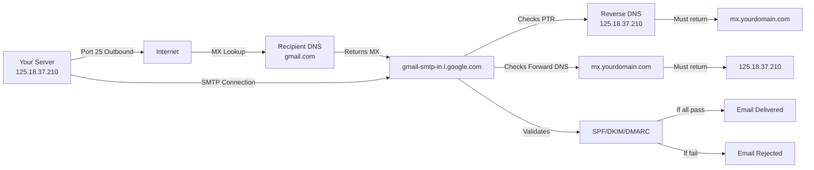
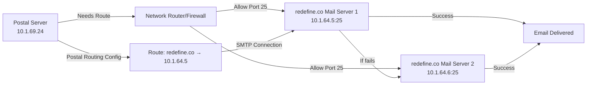

# Postal Mail Server Limitations and Requirements Report

## Executive Summary

**Goal:** Configure Postal mail server to send emails to any recipient, including:
- External domains (Gmail, Yahoo, Outlook, etc.)
- Internal domain (redefine.co - private network mail server)

**Current Status:** Postal is installed and configured, but email delivery is failing for both scenarios due to specific technical limitations.

**Key Findings:**
- External domain delivery blocked by missing PTR (reverse DNS) record
- Internal domain delivery blocked by network routing/firewall issues
- Both scenarios require additional configuration beyond basic Postal setup

---

## Scenario 1: Sending to External Domains (Gmail, Yahoo, etc.)

### Current Issues Encountered

1. **Missing PTR (Reverse DNS) Record**
   - **Error:** Gmail policy 550-5.7.25 rejection
   - **Message:** "The IP address sending this message does not have a PTR record setup, or the corresponding forward DNS entry does not match the sending IP"
   - **Impact:** Gmail and many other providers reject emails from IPs without proper reverse DNS
   - **Sending IP:** `125.18.37.210`

2. **Message-ID Header Missing (Fixed)**
   - **Error:** RFC 5322 compliance issue
   - **Status:** Fixed in scripts - emails now include proper Message-ID headers
   - **Note:** This was causing initial rejections but is now resolved

3. **Recipient Suppression Lists**
   - **Issue:** Repeated failures cause recipients to be added to suppression lists
   - **Impact:** Cannot retry sending to same address until removed from suppression
   - **Solution:** Remove from suppression list in Postal UI or use different test addresses

### Requirements for External Domain Delivery

#### 1. PTR (Reverse DNS) Record
- **What:** Reverse DNS lookup for sending IP must resolve to a hostname
- **Required:** `dig +short -x 125.18.37.210` should return `mx.yourdomain.com` or `yourdomain.com`
- **Who sets it up:** Your hosting provider/VPS provider (not GoDaddy)
- **Action:** Contact hosting provider to set PTR record for `125.18.37.210` → `mx.yourdomain.com`

#### 2. Forward DNS Record (A Record)
- **What:** The hostname from PTR must resolve back to the same IP
- **Required:** `dig +short A mx.yourdomain.com` should return `125.18.37.210`
- **Who sets it up:** You (in GoDaddy or your DNS provider)
- **Action:** Ensure A record exists: `mx.yourdomain.com` → `125.18.37.210`

#### 3. DNS Records (MX, SPF, DKIM, DMARC)
- **MX Record:** Points to mail server (e.g., `10 mx.yourdomain.com`)
- **SPF Record:** Authorizes sending IPs (e.g., `v=spf1 a mx include:spf.yourdomain.com -all`)
- **DKIM Record:** Email authentication (generated by Postal)
- **DMARC Record:** Email policy (recommended)
- **Who sets it up:** You (in GoDaddy or your DNS provider)
- **Action:** Configure all DNS records as shown in Postal web UI

#### 4. Port 25 Accessibility
- **Status:** ✅ Working (outbound connections successful)
- **Required:** Port 25 must be open outbound from your server
- **Verification:** `telnet gmail-smtp-in.l.google.com 25` should connect
- **Note:** Inbound port 25 is only needed if you want to receive emails

#### 5. Email Headers (RFC 5322 Compliance)
- **Status:** ✅ Fixed in scripts
- **Required:** Message-ID, Date, From, To headers
- **Implementation:** Scripts now use `email.utils.make_msgid()` and `formatdate()`

#### 6. IP Reputation
- **What:** Sending IP should have good reputation (no spam history)
- **Impact:** New IPs may have lower deliverability initially
- **Action:** Monitor spam reports, maintain clean sending practices

### Action Items for External Domain Delivery

1. **Contact Hosting Provider**
   - Request PTR record: `125.18.37.210` → `mx.yourdomain.com`
   - Provide your domain name and MX hostname
   - Wait for PTR record to be set up (usually 24-48 hours)

2. **Configure Forward DNS**
   - Add A record: `mx.yourdomain.com` → `125.18.37.210`
   - Verify: `dig +short A mx.yourdomain.com` returns your IP
   - Verify: `dig +short -x 125.18.37.210` returns `mx.yourdomain.com`

3. **Configure DNS Records**
   - Add MX record: `10 mx.yourdomain.com`
   - Add SPF record: `v=spf1 a mx include:spf.yourdomain.com -all`
   - Add DKIM record (from Postal UI)
   - Add DMARC record (recommended)

4. **Wait for DNS Propagation**
   - DNS changes can take 24-48 hours to propagate globally
   - Use tools like `dig` or online DNS checkers to verify

5. **Test with New Email Addresses**
   - Use email addresses not on suppression lists
   - Test with Gmail, Yahoo, Outlook
   - Check spam folders initially

### Network Diagram: External Domain Delivery

---

## Scenario 2: Sending to Internal Domain (redefine.co)

### Current Issues Encountered

1. **Network Routing Failure**
   - **Error:** "No route to host" and "Connection refused"
   - **Sending Server:** `10.1.69.24`
   - **Target Mail Servers:** `10.1.64.5`, `10.1.64.6` (port 25)
   - **Issue:** Server cannot reach private IP mail servers
   - **Root Cause:** Network routing/firewall blocking between subnets

2. **No Public MX Records**
   - **Issue:** redefine.co mail servers are on private network
   - **Impact:** Postal cannot use standard DNS MX lookup
   - **Solution:** Configure Postal routing to use specific IP addresses

3. **Port 25 Connectivity**
   - **Status:** ❌ Blocked/Unreachable
   - **Verification:** `telnet 10.1.64.5 25` fails with connection refused/timeout
   - **Required:** Network path must allow 10.1.69.24 → 10.1.64.5:25

### Requirements for Internal Domain Delivery

#### 1. Network Connectivity
- **What:** Firewall/routing rules to allow communication between subnets
- **Required:** Allow `10.1.69.24` → `10.1.64.5:25` and `10.1.64.6:25`
- **Who sets it up:** Network administrator
- **Action:** Configure firewall rules and routing tables

#### 2. Postal Routing Configuration
- **What:** Configure Postal to send redefine.co emails to specific IPs
- **Required:** Route in Postal UI: `redefine.co` → `10.1.64.5:25`
- **Who sets it up:** You (in Postal web UI)
- **Action:** 
  1. Go to Postal UI → Routing
  2. Add new route for `redefine.co`
  3. Set server address to `10.1.64.5:25`
  4. Optionally add backup: `10.1.64.6:25`

#### 3. Port 25 on Mail Servers
- **What:** redefine.co mail servers must accept connections on port 25
- **Required:** Port 25 must be open and mail server must be listening
- **Who sets it up:** Mail server administrator
- **Action:** Verify mail servers are running and accessible

#### 4. Alternative: Postfix Relay
- **What:** Use Postfix as relay that can reach private network
- **When to use:** If direct routing doesn't work
- **Setup:** Configure Postfix to relay redefine.co to 10.1.64.5:25
- **Action:** Use `install_postfix.py` and configure relay rules

### Action Items for Internal Domain Delivery

1. **Fix Network Connectivity**
   - Verify routing: `ip route get 10.1.64.5`
   - Test connectivity: `telnet 10.1.64.5 25` or `nc -zv 10.1.64.5 25`
   - If fails, contact network admin to:
     - Add firewall rules allowing 10.1.69.24 → 10.1.64.5:25
     - Configure routing between subnets
     - Ensure mail servers accept connections from 10.1.69.24

2. **Configure Postal Routing**
   - Open Postal web UI
   - Navigate to Routing → New Route
   - Domain Pattern: `redefine.co`
   - Server Address: `10.1.64.5:25`
   - Save route

3. **Verify Mail Server Accessibility**
   - From your server: `telnet 10.1.64.5 25`
   - Should see SMTP greeting (220 response)
   - If connection refused, mail server may not be running or firewall blocking

4. **Test Email Sending**
   - Send test email to `user@redefine.co`
   - Check Postal message logs for delivery status
   - Verify email arrives in redefine.co mailbox

### Network Diagram: Internal Domain Delivery

---

## Common Requirements for Both Scenarios

### DNS Configuration
- **MX Record:** Points to mail server hostname
- **A Record:** Mail server hostname resolves to IP
- **SPF Record:** Authorizes sending servers
- **DKIM Record:** Email authentication (from Postal)
- **DMARC Record:** Email policy (recommended)

### Port 25 Requirements
- **External Domains:** Outbound port 25 must be open (✅ working)
- **Internal Domains:** Both inbound and outbound port 25 must be accessible
- **Verification:** Use `telnet` or `nc` to test connectivity

### Postal Configuration
- **postal.yml:** Correct web_hostname, smtp_hostname, DNS settings
- **Caddyfile:** Web interface access configuration
- **SMTP Credentials:** Configured in Postal UI
- **Routing:** Configured for special cases (like redefine.co)

### Email Standards Compliance
- **RFC 5322:** Proper email headers (Message-ID, Date, From, To)
- **SMTP Standards:** Proper SMTP handshake and authentication
- **Content Standards:** Avoid spam triggers, proper formatting

---

## Summary Comparison Table

| Requirement | External Domains (Gmail) | Internal Domain (redefine.co) |
|------------|-------------------------|-------------------------------|
| **PTR Record** | ✅ Required | ❌ Not needed (private IP) |
| **Forward DNS** | ✅ Required (mx.yourdomain.com → IP) | ❌ Not needed (direct IP routing) |
| **MX Records** | ✅ Required | ❌ Not needed (Postal routing) |
| **SPF/DKIM/DMARC** | ✅ Required | ⚠️ Recommended |
| **Port 25 Outbound** | ✅ Required (✅ Working) | ✅ Required |
| **Port 25 Inbound** | ⚠️ Optional (for receiving) | ✅ Required |
| **Network Routing** | ✅ Internet routing (automatic) | ✅ Manual routing required |
| **Firewall Rules** | ⚠️ Outbound only | ✅ Both directions |
| **Postal Routing** | ❌ Not needed | ✅ Required (configure in UI) |
| **IP Reputation** | ✅ Important | ⚠️ Less critical |

---

## Troubleshooting Guide

### External Domain Issues

**Problem:** Gmail rejects with "no PTR record"
- **Solution:** Contact hosting provider to set up PTR record
- **Verify:** `dig +short -x YOUR_IP` should return hostname

**Problem:** "Forward DNS doesn't match"
- **Solution:** Ensure A record for PTR hostname points to sending IP
- **Verify:** `dig +short A mx.yourdomain.com` returns your IP

**Problem:** Emails go to spam
- **Solution:** Check SPF, DKIM, DMARC records are correct
- **Action:** Use Postal UI to get correct DNS records

**Problem:** "Recipient on suppression list"
- **Solution:** Remove from suppression in Postal UI (Messages → Suppressions)
- **Alternative:** Use different test email address

### Internal Domain Issues

**Problem:** "Connection refused" or "No route to host"
- **Solution:** Fix network routing/firewall between subnets
- **Verify:** `telnet 10.1.64.5 25` should connect

**Problem:** "No SMTP servers available"
- **Solution:** Configure Postal routing for redefine.co domain
- **Action:** Add route in Postal UI pointing to 10.1.64.5:25

**Problem:** Connection times out
- **Solution:** Check firewall allows traffic, verify mail server is running
- **Action:** Contact network admin and mail server admin

---

## Next Steps for New Domain

When you get your new domain, you'll need to:

1. **Configure DNS Records** (in your DNS provider):
   - A record: `mx.yourdomain.com` → `YOUR_PUBLIC_IP`
   - MX record: `10 mx.yourdomain.com`
   - SPF, DKIM, DMARC records (from Postal UI)

2. **Request PTR Record** (from hosting provider):
   - PTR: `YOUR_PUBLIC_IP` → `mx.yourdomain.com`
   - Verify forward/reverse DNS match

3. **Configure Postal**:
   - Run `configure_postal.py --domain yourdomain.com`
   - This will update postal.yml and Caddyfile

4. **Configure Internal Routing** (if needed):
   - Add Postal route for redefine.co → 10.1.64.5:25
   - Ensure network connectivity

5. **Test Email Sending**:
   - Test to external domain (Gmail)
   - Test to internal domain (redefine.co)
   - Verify both work correctly

---

## References

- **RFC 5322:** Internet Message Format (email headers)
- **Gmail Policy 550-5.7.25:** PTR record requirements
- **Postal Documentation:** https://docs.postalserver.io/
- **SPF Record Format:** https://tools.ietf.org/html/rfc7208
- **DKIM:** https://tools.ietf.org/html/rfc6376
- **DMARC:** https://tools.ietf.org/html/rfc7489

---

## Conclusion

**External Domain Delivery:** Requires PTR record setup by hosting provider. This is the primary blocker for Gmail and similar providers.

**Internal Domain Delivery:** Requires network routing/firewall configuration to allow communication between subnets. Postal routing must be configured to use specific IP addresses.

Both scenarios are solvable with proper configuration. The external domain issue requires coordination with hosting provider, while internal domain issue requires network administration.
