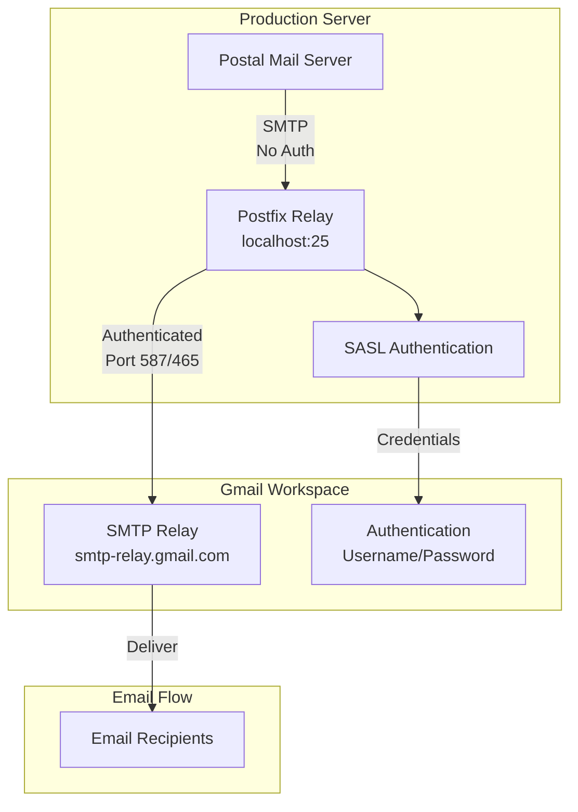
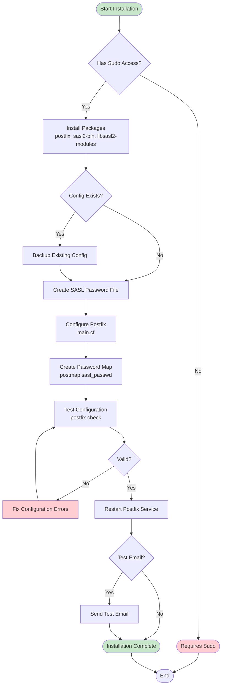
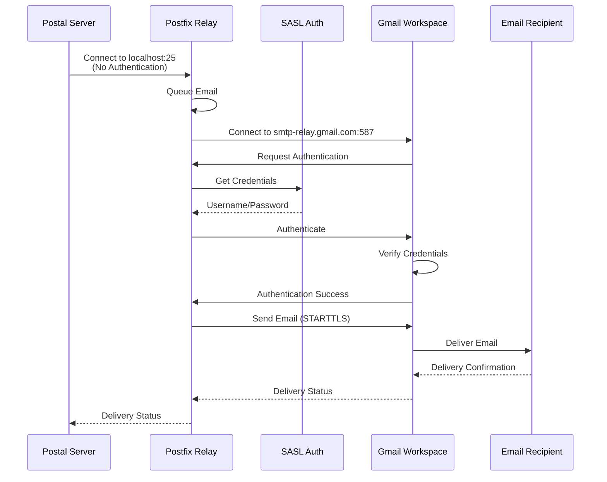

# Postfix Installation Guide - Production

This guide covers installing and configuring Postfix as an authenticated SMTP relay for production use with Gmail Workspace.

## When to Use Postfix

Postfix is required when:
- You need to relay emails through authenticated SMTP servers (like Gmail Workspace)
- Postal's `smtp_relays` doesn't support embedded credentials
- You want to use Gmail Workspace SMTP relay with authentication
- You need a local relay that handles authentication separately

## Prerequisites

Before installing Postfix, ensure you have:

1. **Gmail Workspace Account**: A Google Workspace account with SMTP relay access
2. **SMTP Credentials**: Username and password for Gmail Workspace SMTP
3. **Server Requirements**:
   - **Ubuntu 20.04+ or Debian 11+** (recommended)
   - **Rocky Linux 8+ or 9+** (also supported)
   - Root/sudo access
   - Port 25 available (for local relay)
4. **Network**: Outbound access to Gmail SMTP servers (ports 465 or 587)

## Architecture Overview



## Installation Process



## Step-by-Step Installation

### Step 1: Configure Gmail Workspace SMTP Relay

Before installing Postfix, configure Gmail Workspace SMTP relay:

1. **Get Your Server's Public IP**:
   ```bash
   curl -4 ifconfig.me
   ```

2. **Configure in Google Admin Console**:
   - Log in to https://admin.google.com
   - Navigate to: **Apps** → **Google Workspace** → **Gmail** → **Routing**
   - Scroll to **"SMTP relay service"** section
   - Click **"Configure"** or **"Add Another Rule"**
   - **Rule name**: Enter descriptive name (e.g., "Postfix Relay")
   - **Allowed senders**: Select **"Only addresses in my domains"** (recommended)
   - **Authentication**:
     - ✅ Check **"Only accept mail from the specified IP addresses"**
     - Add your server's public IP
     - Optionally check **"Require SMTP Authentication"** for additional security
   - **Encryption**: ✅ Check **"Require TLS Encryption"**
   - **Save** the rule

**Note**: If you enable "Require SMTP Authentication", you'll need a Workspace account with app password (see Step 1.1 below).

#### Step 1.1: Generate App Password (If Authentication Required)

If you enabled "Require SMTP Authentication" in the relay settings:

1. **Enable 2FA on Workspace Account** (if not already enabled)
2. **Generate App Password**:
   - Go to https://myaccount.google.com/apppasswords
   - Select **"Mail"** or **"Other (Custom name)"**
   - Enter name (e.g., "Postfix Workspace Relay")
   - Click **"Generate"**
   - Copy the 16-character password

### Step 2: Run Installation Script

For Gmail Workspace, you typically use port 587 (STARTTLS) or port 465 (SMTPS):

**Option 1: IP Whitelisted (No Authentication) - Recommended**
```bash
# Port 587 (STARTTLS) - Recommended
uv run --with typer --with rich \
  src/gishant_scripts/postal/install_postfix.py main \
  --gmail-address "your-email@yourdomain.com" \
  --app-password "dummy-password" \
  --relay-host "smtp-relay.gmail.com" \
  --relay-port 587
```

**Note**: When IP is whitelisted, authentication is not required, but the script still needs a password parameter (use any value).

**Option 2: With Authentication**
```bash
# Port 587 (STARTTLS) with app password
uv run --with typer --with rich \
  src/gishant_scripts/postal/install_postfix.py main \
  --gmail-address "your-email@yourdomain.com" \
  --app-password "your-workspace-app-password" \
  --relay-host "smtp-relay.gmail.com" \
  --relay-port 587

# Port 465 (SMTPS) with app password
uv run --with typer --with rich \
  src/gishant_scripts/postal/install_postfix.py main \
  --gmail-address "your-email@yourdomain.com" \
  --app-password "your-workspace-app-password" \
  --relay-host "smtp-relay.gmail.com" \
  --relay-port 465
```

**Parameters:**
- `--gmail-address`: Your Gmail Workspace email address
- `--app-password`: Gmail Workspace SMTP password (or app password if 2FA enabled)
- `--relay-host`: Gmail Workspace SMTP relay hostname (default: `smtp-relay.gmail.com`)
- `--relay-port`: Port 587 (STARTTLS) or 465 (SMTPS)
- `--test-recipient`: Optional email to send test email
- `--skip-test`: Skip sending test email

### Step 2: Verify Installation

```bash
# Check Postfix status
uv run --with typer --with rich \
  src/gishant_scripts/postal/install_postfix.py status

# Show configuration
uv run --with typer --with rich \
  src/gishant_scripts/postal/install_postfix.py show-config
```

### Step 3: Test Email Delivery

```bash
# Send test email
uv run --with typer --with rich \
  src/gishant_scripts/postal/install_postfix.py test \
  --recipient "test@example.com" \
  --subject "Postfix Test Email"
```

## Configuration Details

### Postfix Main Configuration

Location: `/etc/postfix/main.cf`

**For Port 587 (STARTTLS):**
```ini
relayhost = [smtp-relay.gmail.com]:587
smtp_use_tls = yes
smtp_sasl_auth_enable = yes
smtp_sasl_password_maps = hash:/etc/postfix/sasl_passwd
smtp_sasl_security_options = noanonymous
smtp_tls_security_level = may
smtp_tls_CAfile = /etc/pki/tls/certs/ca-bundle.crt
```

**For Port 465 (SMTPS):**
```ini
relayhost = [smtp-relay.gmail.com]:465
smtp_use_tls = yes
smtp_sasl_auth_enable = yes
smtp_sasl_password_maps = hash:/etc/postfix/sasl_passwd
smtp_sasl_security_options = noanonymous
smtp_tls_wrappermode = yes
smtp_tls_security_level = encrypt
smtp_tls_CAfile = /etc/pki/tls/certs/ca-bundle.crt
```

### SASL Password File

Location: `/etc/postfix/sasl_passwd`

Format:
```
[smtp-relay.gmail.com]:587    your-email@yourdomain.com:your-password
```

**Security**: File is secured with `chmod 600` (only root can read)

### Password Map

After creating `sasl_passwd`, create the hash map:
```bash
sudo postmap /etc/postfix/sasl_passwd
```

This creates `/etc/postfix/sasl_passwd.db` which Postfix uses.

## Port 587 vs 465

### Port 587 (STARTTLS) - Recommended

**Advantages:**
- More flexible (can fall back to plain if needed)
- Standard port for submission
- Better compatibility

**Configuration:**
- `smtp_tls_security_level = may` (opportunistic TLS)
- No wrappermode needed
- TLS negotiated after connection

### Port 465 (SMTPS)

**Advantages:**
- Implicit TLS (encrypted from start)
- Simpler configuration for some setups

**Configuration:**
- `smtp_tls_wrappermode = yes` (required)
- `smtp_tls_security_level = encrypt` (mandatory encryption)
- TLS from connection start

## Integration with Postal

After installing Postfix, configure Postal to use it:

```bash
uv run --with typer --with rich --with pyyaml \
  src/gishant_scripts/postal/install_postal.py add-postfix-relay
```

This adds `smtp://127.0.0.1:25?ssl_mode=none` to Postal's configuration.

## Email Delivery Flow



## Troubleshooting

### Issue: Authentication Failures

**Symptoms**: Emails stuck in queue, "authentication failed" errors

**Solutions**:
1. Verify credentials in `/etc/postfix/sasl_passwd`
2. Check password format (no extra spaces)
3. Recreate password map: `sudo postmap /etc/postfix/sasl_passwd`
4. Check Postfix logs: `sudo tail -f /var/log/mail.log`
5. Verify Gmail Workspace SMTP is enabled
6. For 2FA accounts, use app password instead of regular password

### Issue: Connection Timeouts

**Symptoms**: Cannot connect to Gmail SMTP relay

**Solutions**:
1. Verify network connectivity: `telnet smtp-relay.gmail.com 587`
2. Check firewall rules (outbound ports 587/465)
3. Verify DNS resolution: `nslookup smtp-relay.gmail.com`
4. Check if IP is whitelisted (if required by Gmail Workspace)

### Issue: TLS/SSL Errors

**Symptoms**: TLS handshake failures, certificate errors

**Solutions**:
1. **Verify CA certificates**:
   - **Ubuntu/Debian**: `ls /etc/ssl/certs/ca-certificates.crt`
   - **Rocky Linux**: `ls /etc/pki/tls/certs/ca-bundle.crt`
2. **Update CA certificates**:
   - **Ubuntu/Debian**: `sudo apt-get update && sudo apt-get install ca-certificates`
   - **Rocky Linux**: `sudo dnf update ca-certificates`
3. Check TLS configuration in `main.cf`
4. For port 465, ensure `smtp_tls_wrappermode = yes`
5. Verify `smtp_tls_CAfile` path matches your distribution

### Issue: Emails Not Delivering

**Symptoms**: Emails in queue but not sending

**Solutions**:
1. Check Postfix queue: `sudo postqueue -p`
2. Check Postfix logs: `sudo tail -f /var/log/mail.log`
3. Verify relayhost configuration
4. Test connectivity: `sudo postfix check`
5. Restart Postfix: `sudo systemctl restart postfix`

## Maintenance

### View Postfix Queue

```bash
# View all queued emails
sudo postqueue -p

# Flush queue (retry all)
sudo postqueue -f

# Delete specific message
sudo postsuper -d <queue-id>
```

### Check Postfix Logs

```bash
# Real-time log monitoring
sudo tail -f /var/log/mail.log

# Search for errors
sudo grep -i error /var/log/mail.log

# Search for specific email
sudo grep "message-id" /var/log/mail.log
```

### Update Credentials

1. Edit `/etc/postfix/sasl_passwd`
2. Update password
3. Recreate map: `sudo postmap /etc/postfix/sasl_passwd`
4. Reload Postfix: `sudo systemctl reload postfix`

### Backup Configuration

```bash
# Backup main configuration
sudo cp /etc/postfix/main.cf /etc/postfix/main.cf.backup

# Backup SASL password (secure location)
sudo cp /etc/postfix/sasl_passwd ~/sasl_passwd.backup
sudo chmod 600 ~/sasl_passwd.backup
```

## Firewall Configuration

Postfix should only accept connections from localhost (127.0.0.1) for security.

### Ubuntu/Debian (ufw)

```bash
# Allow localhost connections (default)
# Block external access to port 25 if needed
sudo ufw deny 25/tcp
sudo ufw allow from 127.0.0.1 to any port 25
```

### Rocky Linux (firewalld)

```bash
# Configure Postfix to only listen on localhost
# Edit /etc/postfix/main.cf and set:
# inet_interfaces = loopback-only

# Or use firewalld rich rules
sudo firewall-cmd --zone=public --permanent --add-rich-rule='rule family="ipv4" source address="127.0.0.1" port port="25" protocol="tcp" accept'
sudo firewall-cmd --zone=public --permanent --remove-port=25/tcp
sudo firewall-cmd --reload
```

## Security Considerations

1. **SASL Password File**: Always secured with `chmod 600`
2. **Firewall**: Only allow localhost connections on port 25
3. **TLS**: Always use TLS for SMTP connections
4. **Credentials**: Store credentials securely, never commit to git
5. **Updates**: Keep Postfix and system packages updated
6. **Monitoring**: Monitor Postfix logs for suspicious activity

## Next Steps

After installing Postfix:
1. Configure Postal to use Postfix relay
2. Test email delivery
3. Set up monitoring and alerting
4. Configure proper DNS records (SPF, DKIM, DMARC)
5. See [Production Workflow Guide](PRODUCTION_WORKFLOW.md) for complete setup
