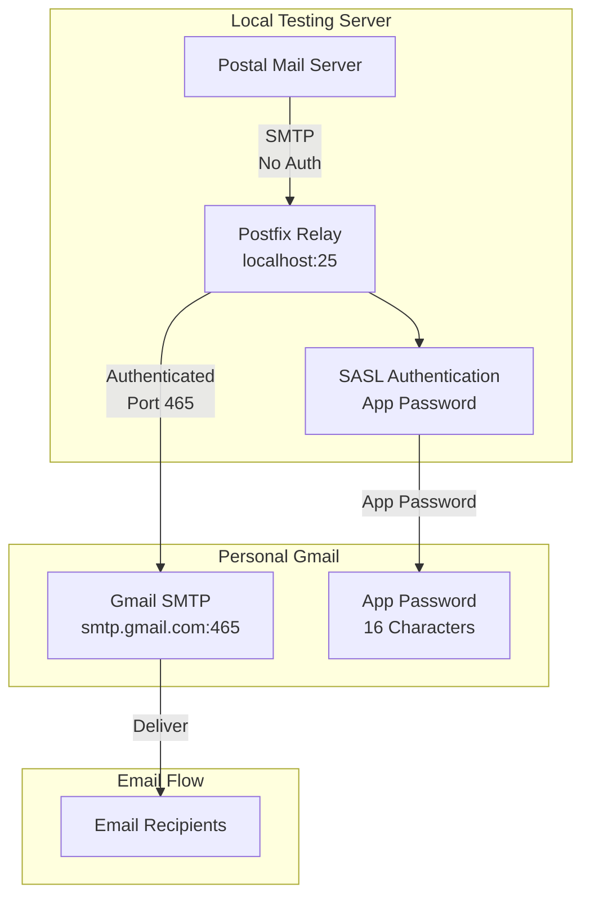
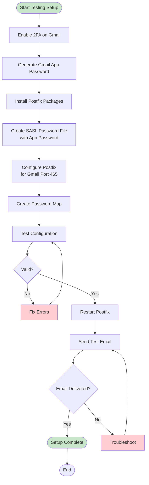
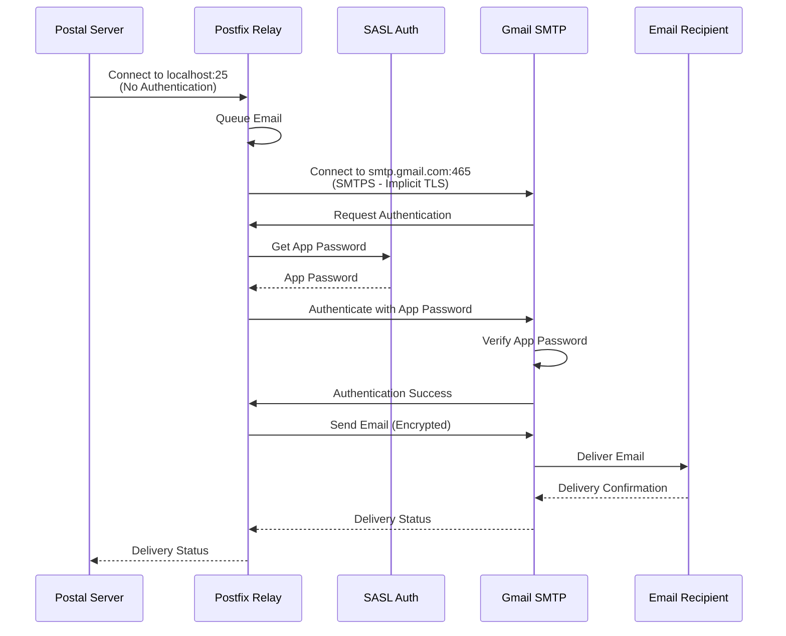

# Postfix Installation Guide - Testing

This guide covers installing and configuring Postfix as an authenticated SMTP relay for local testing with personal Gmail.

## Why Postfix for Testing?

Postal's `smtp_relays` does **not** support authenticated external SMTP relays. For personal Gmail (which requires authentication), Postfix acts as an intermediary:

- **Postal** → `localhost:25` (Postfix, no authentication needed)
- **Postfix** → `smtp.gmail.com:465` (Gmail, authenticated with app password)

This allows you to test Postal's functionality locally without needing Gmail Workspace or IP whitelisting.

## Prerequisites

Before installing Postfix for testing, ensure you have:

1. **Personal Gmail Account**: A Gmail account with 2FA enabled
2. **Gmail App Password**: A 16-character app password generated from Google Account settings
3. **Server Requirements**:
   - **Ubuntu 20.04+ or Debian 11+** (recommended)
   - **Rocky Linux 8+ or 9+** (also supported)
   - Root/sudo access
   - Port 25 available (for local relay)
4. **Network**: Outbound access to Gmail SMTP servers (ports 465 or 587)

## Architecture Overview



## Installation Process



## Step-by-Step Installation

### Step 1: Generate Gmail App Password

**Important**: As of 2024, Google requires 2FA and app passwords for SMTP access. Regular passwords will not work.

1. **Enable 2-Step Verification (2FA)**:
   - Go to https://myaccount.google.com/security
   - In the **"Signing in to Google"** section, find **"2-Step Verification"**
   - Click **"Get Started"** or **"Turn On"**
   - Follow the setup wizard:
     - Choose verification method (phone, authenticator app, security key)
     - Complete verification
   - **Note**: If you don't see "App Passwords" option, ensure 2FA is fully enabled (not just security keys)

2. **Generate App Password**:
   - Go to https://myaccount.google.com/apppasswords
   - Sign in if prompted
   - Under **"Select app"**, choose:
     - **"Mail"** (for email apps), OR
     - **"Other (Custom name)"** and enter a descriptive name (e.g., "Postfix Relay")
   - Under **"Select device"**, choose:
     - **"Other (Custom name)"** and enter device name (e.g., "Mail Server")
   - Click **"Generate"**
   - **Copy the 16-character password immediately** - it won't be shown again
   - Password format: `xxxx xxxx xxxx xxxx` (spaces can be included or removed)

**Important Notes**:
- App passwords are required when 2FA is enabled
- If you change your main Google password, all app passwords are revoked
- App passwords are not available if Advanced Protection is enabled
- For Workspace accounts, admin must allow app passwords

**Troubleshooting**:
- **App Passwords not visible?**
  - Ensure 2FA is fully enabled (not just security keys)
  - Check that Advanced Protection is not enabled
  - For Workspace accounts, check admin settings

### Step 2: Run Installation Script

```bash
uv run --with typer --with rich \
  src/gishant_scripts/postal/install_postfix.py main \
  --gmail-address "your.email@gmail.com" \
  --app-password "your-16-char-app-password" \
  --relay-host "smtp.gmail.com" \
  --relay-port 465 \
  --test-recipient "your.email@gmail.com"
```

**Parameters:**
- `--gmail-address`: Your Gmail email address (e.g., `your.email@gmail.com`)
- `--app-password`: Gmail app password (16 characters, spaces are OK)
- `--relay-host`: Gmail SMTP hostname (default: `smtp.gmail.com`)
- `--relay-port`: Port 465 (SMTPS) or 587 (STARTTLS) - default: 465
- `--test-recipient`: Email address to send test email to
- `--skip-test`: Skip sending test email

**Example:**
```bash
uv run --with typer --with rich \
  src/gishant_scripts/postal/install_postfix.py main \
  --gmail-address "gishantsngh@gmail.com" \
  --app-password "uraf ipla cfws ukmn" \
  --test-recipient "gishantsngh@gmail.com"
```

### Step 3: Verify Installation

```bash
# Check Postfix status
uv run --with typer --with rich \
  src/gishant_scripts/postal/install_postfix.py status

# Show configuration (passwords masked)
uv run --with typer --with rich \
  src/gishant_scripts/postal/install_postfix.py show-config
```

### Step 4: Test Email Delivery

```bash
# Send test email through Postfix
uv run --with typer --with rich \
  src/gishant_scripts/postal/install_postfix.py test \
  --recipient "your.email@gmail.com" \
  --subject "Postfix Test Email" \
  --sender "your.email@gmail.com"
```

## Configuration Details

### Postfix Main Configuration

Location: `/etc/postfix/main.cf`

**For Port 465 (SMTPS) - Recommended for Gmail:**
```ini
relayhost = [smtp.gmail.com]:465
smtp_use_tls = yes
smtp_sasl_auth_enable = yes
smtp_sasl_password_maps = hash:/etc/postfix/sasl_passwd
smtp_sasl_security_options = noanonymous
smtp_tls_wrappermode = yes
smtp_tls_security_level = encrypt
smtp_tls_CAfile = /etc/pki/tls/certs/ca-bundle.crt
```

**For Port 587 (STARTTLS):**
```ini
relayhost = [smtp.gmail.com]:587
smtp_use_tls = yes
smtp_sasl_auth_enable = yes
smtp_sasl_password_maps = hash:/etc/postfix/sasl_passwd
smtp_sasl_security_options = noanonymous
smtp_tls_security_level = may
smtp_tls_CAfile = /etc/pki/tls/certs/ca-bundle.crt
```

### SASL Password File

Location: `/etc/postfix/sasl_passwd`

Format:
```
[smtp.gmail.com]:465    your.email@gmail.com:your-app-password
```

**Security**: File is secured with `chmod 600` (only root can read)

**Important**:
- App password should be 16 characters (spaces can be included or removed)
- Use the exact app password generated from Google Account settings
- Do not use your regular Gmail password

### Password Map

After creating `sasl_passwd`, create the hash map:
```bash
sudo postmap /etc/postfix/sasl_passwd
```

This creates `/etc/postfix/sasl_passwd.db` which Postfix uses.

## Port 465 vs 587 for Gmail

### Port 465 (SMTPS) - Recommended

**Why Port 465:**
- Gmail's primary SMTP port for authenticated connections
- Implicit TLS (encrypted from connection start)
- More reliable for app passwords

**Configuration:**
- `smtp_tls_wrappermode = yes` (required)
- `smtp_tls_security_level = encrypt` (mandatory encryption)

### Port 587 (STARTTLS)

**When to Use:**
- If port 465 is blocked by firewall
- For compatibility with some network configurations

**Configuration:**
- `smtp_tls_security_level = may` (opportunistic TLS)
- No wrappermode needed

## Integration with Postal

After installing Postfix, configure Postal to use it:

```bash
uv run --with typer --with rich --with pyyaml \
  src/gishant_scripts/postal/install_postal.py add-postfix-relay
```

This adds `smtp://127.0.0.1:25?ssl_mode=none` to Postal's configuration.

## Email Delivery Flow



## Troubleshooting

### Issue: App Password Authentication Fails

**Symptoms**: "authentication failed" errors, emails stuck in queue

**Solutions**:
1. Verify app password is correct (16 characters)
2. Ensure 2FA is enabled on Gmail account
3. Regenerate app password if needed
4. Check SASL password file format: `sudo cat /etc/postfix/sasl_passwd`
5. Recreate password map: `sudo postmap /etc/postfix/sasl_passwd`
6. Check Postfix logs: `sudo tail -f /var/log/mail.log | grep -i auth`

### Issue: Connection Refused

**Symptoms**: Cannot connect to Gmail SMTP

**Solutions**:
1. Verify network connectivity: `telnet smtp.gmail.com 465`
2. Check firewall rules (outbound ports 465/587)
3. Verify DNS resolution: `nslookup smtp.gmail.com`
4. Try port 587 if 465 is blocked

### Issue: TLS/SSL Errors

**Symptoms**: TLS handshake failures, certificate errors

**Solutions**:
1. **Verify CA certificates**:
   - **Ubuntu/Debian**: `ls /etc/ssl/certs/ca-certificates.crt`
   - **Rocky Linux**: `ls /etc/pki/tls/certs/ca-bundle.crt`
2. **Update CA certificates**:
   - **Ubuntu/Debian**: `sudo apt-get update && sudo apt-get install ca-certificates`
   - **Rocky Linux**: `sudo dnf update ca-certificates`
3. For port 465, ensure `smtp_tls_wrappermode = yes`
4. Check TLS configuration in `main.cf`
5. Verify `smtp_tls_CAfile` path matches your distribution

### Issue: Gmail Rate Limits

**Symptoms**: Emails not sending, rate limit errors

**Solutions**:
1. Gmail free accounts have daily sending limits (500 emails/day)
2. Wait before retrying
3. Consider using Gmail Workspace for higher limits
4. Check Gmail account status

### Issue: Emails in Queue But Not Sending

**Symptoms**: Emails queued but not delivering

**Solutions**:
1. Check Postfix queue: `sudo postqueue -p`
2. Check Postfix logs: `sudo tail -f /var/log/mail.log`
3. Verify relayhost configuration
4. Test configuration: `sudo postfix check`
5. Flush queue: `sudo postqueue -f`

## Testing Scenarios

### Test 1: Direct Postfix Test

```bash
# Send email directly through Postfix
echo "Test email body" | mail -s "Test Subject" your.email@gmail.com
```

### Test 2: Check Postfix Logs

```bash
# Real-time log monitoring
sudo tail -f /var/log/mail.log

# Search for specific email
sudo grep "your.email@gmail.com" /var/log/mail.log
```

### Test 3: Verify Configuration

```bash
# Check Postfix configuration
sudo postfix check

# Show Postfix configuration
sudo postconf | grep relayhost
sudo postconf | grep sasl
```

## Gmail Limitations

1. **Daily Sending Limits**:
   - Free Gmail: 500 emails/day
   - Gmail Workspace: 2000 emails/day

2. **Rate Limits**:
   - Maximum 100 recipients per email
   - Maximum 20MB attachment size

3. **Spam Filtering**:
   - Emails may be marked as spam without proper DNS setup
   - SPF, DKIM, DMARC records help but not required for testing

## Maintenance

### Update App Password

If you need to update the app password:

1. Generate new app password from Google Account
2. Edit `/etc/postfix/sasl_passwd`:
```bash
sudo nano /etc/postfix/sasl_passwd
```
3. Update the password
4. Recreate map: `sudo postmap /etc/postfix/sasl_passwd`
5. Reload Postfix: `sudo systemctl reload postfix`

### View Postfix Queue

```bash
# View all queued emails
sudo postqueue -p

# Flush queue (retry all)
sudo postqueue -f

# Delete specific message
sudo postsuper -d <queue-id>
```

### Backup Configuration

```bash
# Backup main configuration
sudo cp /etc/postfix/main.cf /etc/postfix/main.cf.backup

# Backup SASL password (secure location)
sudo cp /etc/postfix/sasl_passwd ~/sasl_passwd.backup
sudo chmod 600 ~/sasl_passwd.backup
```

## Firewall Configuration

Postfix should only accept connections from localhost (127.0.0.1) for security.

### Ubuntu/Debian (ufw)

```bash
# Allow localhost connections (default)
# Block external access to port 25 if needed
sudo ufw deny 25/tcp
sudo ufw allow from 127.0.0.1 to any port 25
```

### Rocky Linux (firewalld)

```bash
# Configure Postfix to only listen on localhost
# Edit /etc/postfix/main.cf and set:
# inet_interfaces = loopback-only

# Or use firewalld rich rules
sudo firewall-cmd --zone=public --permanent --add-rich-rule='rule family="ipv4" source address="127.0.0.1" port port="25" protocol="tcp" accept'
sudo firewall-cmd --zone=public --permanent --remove-port=25/tcp
sudo firewall-cmd --reload
```

## Security Considerations

1. **SASL Password File**: Always secured with `chmod 600`
2. **App Passwords**: Store securely, never commit to git
3. **Firewall**: Only allow localhost connections on port 25
4. **TLS**: Always use TLS for SMTP connections
5. **Updates**: Keep Postfix and system packages updated

## Next Steps

After installing Postfix for testing:
1. Install Postal (see [Postal Installation Testing Guide](POSTAL_INSTALL_TESTING.md))
2. Connect Postal to Postfix
3. Test complete email flow
4. See [Testing Workflow Guide](TESTING_WORKFLOW.md) for complete setup

## Quick Reference

```bash
# Install Postfix with Gmail
uv run src/gishant_scripts/postal/install_postfix.py main \
  --gmail-address "your.email@gmail.com" \
  --app-password "your-app-password"

# Check status
uv run src/gishant_scripts/postal/install_postfix.py status

# Send test email
uv run src/gishant_scripts/postal/install_postfix.py test \
  --recipient "your.email@gmail.com"

# Show configuration
uv run src/gishant_scripts/postal/install_postfix.py show-config
```
