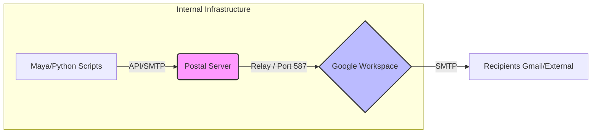
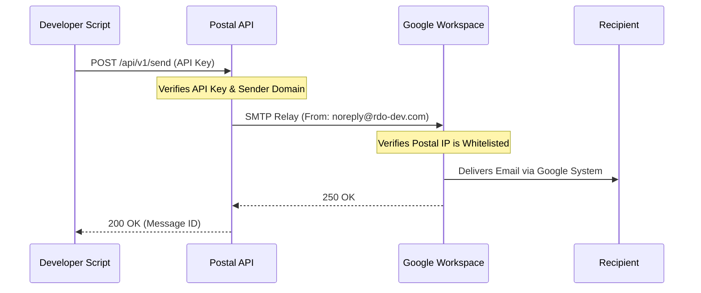

# Postal Production Deployment Guide (Rocky Linux 9)

This guide details how to take your Postal installation to production on **Rocky Linux 9**, including integration with **Google Workspace** for email relaying.

## Scenario: Enterprise Email Gateway
**Goal**: Use Postal as a central gateway for internal services (scripts, tools) to send emails to users (Artists, Staff) via your existing **Google Workspace Enterprise** account.

**Flow**: `Internal Script` -> `Postal API/SMTP` -> `Google Workspace Relay` -> `Recipient (Gmail)`

## 1. Operating System: Rocky Linux 9

Rocky Linux 9 is a supported Enterprise Linux distribution. The automated `install_postal.py` script supports it via `dnf`.

### Prerequisites for Rocky 9
1.  **SELinux**: Postal containers need access. You might need to set SELinux to permissive or configure policies correctly.
    ```bash
    sudo setenforce 0
    sudo sed -i 's/^SELINUX=enforcing/SELINUX=permissive/' /etc/selinux/config
    ```
2.  **Firewall**: Ensure ports `80`, `443`, and `25` are open.
    ```bash
    sudo firewall-cmd --permanent --add-service=http
    sudo firewall-cmd --permanent --add-service=https
    sudo firewall-cmd --permanent --add-port=25/tcp
    sudo firewall-cmd --reload
    ```

## 2. Google Workspace Configuration (The Relay)

To allow Postal to send email on behalf of your domain without getting blocked, you must authorize its IP in Google Workspace.

1.  Log in to **Google Admin Console** (admin.google.com).
2.  Navigate to **Apps** > **Google Workspace** > **Gmail** > **Routing**.
3.  Scroll down to **SMTP relay service**.
4.  Click **Configure** (or "Add Rule").
    *   **Allowed senders**: Select **"Only addresses in my domains"** (Security Best Practice).
    *   **Authentication**: Check **"Only accept mail from the specified IP addresses"**.
    *   **IP Address**: Add the **Public IP** of your Postal Server.
    *   **Encryption**: Check **"Require TLS encryption"**.
5.  Click **Save**.
    *   *Effect*: Google will now accept authenticated SMTP traffic from your Postal server's IP, provided the sender address matches your Workspace domains (e.g., `@rdo-dev.com`).

## 3. Configuring Postal to Use the Relay

You need to tell Postal to route all outgoing mail to Google instead of trying to deliver it directly.

### Method: Per-Server Configuration (Recommended)
1.  Log in to the Postal Web UI.
2.  Click on your **Mail Server** (e.g., "System Notifications").
3.  Go to **Settings** > **Sending**.
4.  Configure **Upstream SMTP Server**:
    *   **Hostname**: `smtp-relay.gmail.com`
    *   **Port**: `587`
    *   **Encryption**: `STARTTLS`
    *   **Username/Password**: *Leave Empty* (Authentication is handled via IP whitelist configured in Step 2).
5.  Click **Save Settings**.

## 4. Domain Setup for Developers

Before developers can send emails, the sending domain must be authorized in Postal.

1.  Go to **Mail Server** > **Domains**.
2.  Click **Add Domain**.
3.  Enter the domain name (e.g., `rdo-dev.com`).
4.  Click **Create Domain**.
    *   *Note*: Since you are relaying via Google, you might not strictly need to configure DKIM/SPF *on Postal* if Google handles signing, but it is best practice to follow the DNS instructions Postal provides to ensure alignment.

## 5. Developer Guide: Sending Emails

Developers can use Postal to send notifications from their scripts.

### Step A: Get Credentials
1.  Go to **Mail Server** > **Credentials**.
2.  Create a new **API Key** (Select "SMTP/Recall/Log").
3.  Give this Key to the developer.

### Step B: Integration Example (Python)

Developers should use the API for better performance and logging.

```python
import requests

POSTAL_URL = "https://postal.example.com/api/v1/send/message"
API_KEY = "YOUR_API_KEY"

payload = {
    "to": ["artist@gmail.com"],
    "from": "noreply@rdo-dev.com", # Must match the domain added in Step 4
    "subject": "Render Complete: Shot 001",
    "plain_body": "Your render has finished successfully."
}

response = requests.post(
    POSTAL_URL,
    json=payload,
    headers={"X-Server-API-Key": API_KEY}
)

if response.status_code == 200:
    print("Email Sent!", response.json()['data']['message_id'])
else:
    print("Error:", response.json())
```

## 6. Architecture Overview

The following diagrams illustrate how the Postal infrastructure fits into your Redefine Originals ecosystem.

### Email Flow



### Authorization Flow



## 7. Production SSL Certificates

For a true production environment, you should replace the self-signed certificates with valid SSL certificates.

### Option A: Let's Encrypt (Automatic)
If your server is publicly accessible on port 80/443:
1.  Open `/opt/postal/config/Caddyfile`.
2.  **Remove** the line `tls internal`.
3.  Ensure your domain (`postal.yourdomain.com`) resolves to the server's public IP.
4.  Restart Caddy: `docker restart postal-caddy`.
    *   Caddy will automatically fetch and renew certificates from Let's Encrypt.

### Option B: Custom Certificates (Enterprise)
If you have your own certificates (e.g., specific internal CA or purchased wildcard):

1.  **Upload Certificates**: Place your `.crt` and `.key` files on the server (e.g., `/opt/postal/config/certs/`).
2.  **Update Container**: You must mount this directory into the Caddy container.
    *   Stop the container: `docker rm -f postal-caddy`
    *   Run Caddy with the volume map:
        ```bash
        docker run -d \
           --name postal-caddy \
           --restart always \
           --network host \
           -v /opt/postal/config/Caddyfile:/etc/caddy/Caddyfile \
           -v /opt/postal/caddy-data:/data \
           -v /opt/postal/config/certs:/certs \
           caddy
        ```
3.  **Update Caddyfile**:
    Edit `/opt/postal/config/Caddyfile` to use the mounted paths:
    ```caddyfile
    postal.yourdomain.com {
        tls /certs/your_domain.crt /certs/your_domain.key
        reverse_proxy 127.0.0.1:5001
    }
    ```
4.  **Restart**: `docker restart postal-caddy`.
