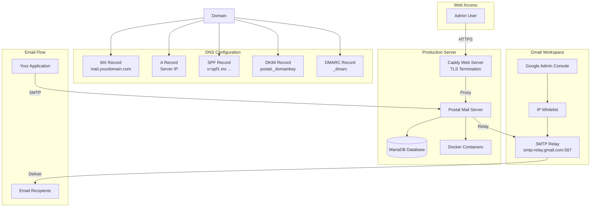
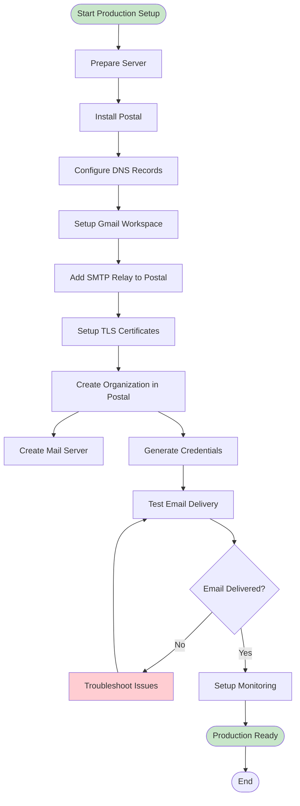
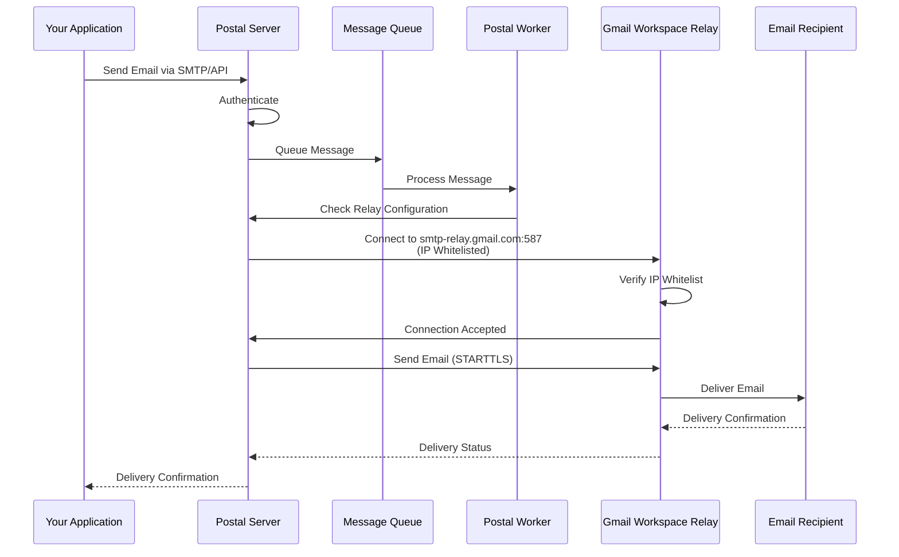

# Production Setup Workflow - Postal with Gmail Workspace

This guide provides a complete end-to-end workflow for setting up Postal in production with Gmail Workspace SMTP relay.

## Overview

This workflow covers:
1. Server preparation
2. Postal installation
3. DNS configuration
4. Gmail Workspace SMTP relay setup
5. TLS/SSL certificate configuration
6. Testing and verification
7. Monitoring and maintenance

## Complete Architecture



## Complete Workflow



## Step-by-Step Workflow

### Step 1: Prepare Server

#### 1.1 System Requirements

- Ubuntu 20.04+ or Debian 11+
- Minimum 2GB RAM (4GB recommended)
- 20GB+ free disk space
- Root/sudo access
- Ports 25, 80, 443, 5000 available

#### 1.2 Update System

```bash
sudo apt-get update
sudo apt-get upgrade -y
```

#### 1.3 Install Prerequisites

```bash
# Install Python and uv if not already installed
curl -LsSf https://astral.sh/uv/install.sh | sh

# Install required Python packages
uv pip install typer rich pyyaml requests
```

### Step 2: Install Postal

```bash
uv run --with typer --with rich --with pyyaml \
  src/gishant_scripts/postal/install_postal.py main \
  --domain "mail.yourdomain.com" \
  --db-password "secure-db-password" \
  --admin-email "admin@yourdomain.com" \
  --admin-password "secure-admin-password"
```

**What this does:**
- Installs Docker and Docker Compose
- Sets up Postal repository
- Configures MariaDB database
- Bootstraps Postal configuration
- Sets up Caddy web server
- Initializes Postal database
- Creates admin user
- Starts all services

**Expected Output:**
- Postal web UI accessible at `https://mail.yourdomain.com`
- Admin credentials for web login
- Internal web port (default: 5000)

### Step 3: Configure DNS Records

Configure the following DNS records for your domain:

#### 3.1 MX Record

```
Type: MX
Name: @ (or your mail subdomain)
Priority: 10
Value: mail.yourdomain.com
TTL: 3600
```

#### 3.2 A Record

```
Type: A
Name: mail
Value: <your-server-public-ip>
TTL: 3600
```

#### 3.3 SPF Record

```
Type: TXT
Name: @
Value: v=spf1 mx a:mail.yourdomain.com ~all
TTL: 3600
```

#### 3.4 DKIM Record

1. Log in to Postal web UI
2. Navigate to your mail server
3. Go to "DNS" section
4. Copy the DKIM public key
5. Add TXT record:

```
Type: TXT
Name: postal._domainkey
Value: <dkim-public-key-from-postal>
TTL: 3600
```

#### 3.5 DMARC Record

```
Type: TXT
Name: _dmarc
Value: v=DMARC1; p=quarantine; rua=mailto:admin@yourdomain.com
TTL: 3600
```

**Verify DNS:**
```bash
# Check MX record
dig MX yourdomain.com

# Check A record
dig A mail.yourdomain.com

# Check SPF record
dig TXT yourdomain.com

# Check DKIM record
dig TXT postal._domainkey.yourdomain.com

# Check DMARC record
dig TXT _dmarc.yourdomain.com
```

### Step 4: Setup Gmail Workspace SMTP Relay

#### 4.1 Get Your Server's Public IP

```bash
# Get your server's public IP address
curl -4 ifconfig.me
# or
curl -4 icanhazip.com
```

Save this IP address - you'll need it for whitelisting.

#### 4.2 Configure Gmail Workspace SMTP Relay

1. **Log in to Google Admin Console**: https://admin.google.com
   - You need admin access to your Google Workspace account

2. **Navigate to SMTP Relay Settings**:
   - Go to: **Apps** → **Google Workspace** → **Gmail** → **Routing**
   - Scroll down to **"SMTP relay service"** section
   - Click **"Configure"** or **"Add Another Rule"**

3. **Configure the Relay Rule**:
   - **Rule name**: Enter a descriptive name (e.g., "Postal Mail Server")
   - **Allowed senders**: Select one of:
     - **"Only addresses in my domains"** (recommended) - Only emails from your Workspace domain
     - **"Only registered app users in my domains"** - More restrictive
     - **"Any addresses"** - Less secure, use with caution

   - **Authentication**:
     - ✅ Check **"Only accept mail from the specified IP addresses"**
     - Add your server's public IP address (from Step 4.1)
     - Optionally check **"Require SMTP Authentication"** for additional security

   - **Encryption**:
     - ✅ Check **"Require TLS Encryption"** (recommended)

4. **Save the rule**
   - Changes may take up to 24 hours to propagate (usually much faster)

**Important Notes:**
- IP whitelisting allows relaying without username/password authentication
- If you enable "Require SMTP Authentication", you'll also need to use a Workspace account with app password
- Keep your IP range as narrow as possible for security

#### 4.3 Add SMTP Relay to Postal

**For IP-whitelisted relay (no authentication):**
```bash
uv run --with typer --with rich --with pyyaml \
  src/gishant_scripts/postal/install_postal.py add-relay \
  --host "smtp-relay.gmail.com" \
  --port 587 \
  --ssl-mode "StartTLS"
```

**Note**: Gmail Workspace SMTP relay does not require authentication when IP is whitelisted.

**Alternative: If you enabled "Require SMTP Authentication"**:
You'll need to use Postfix as an intermediary (see [Postfix Installation Production Guide](POSTFIX_INSTALL_PRODUCTION.md)) since Postal's `smtp_relays` doesn't support embedded credentials.

**Verify Relay:**
```bash
# Test relay connectivity
uv run --with typer --with rich --with pyyaml \
  src/gishant_scripts/postal/install_postal.py test-relay \
  --host "smtp-relay.gmail.com" \
  --port 587
```

**SMTP Server Details:**
- **Host**: `smtp-relay.gmail.com`
- **Port**: `587` (recommended, with STARTTLS) or `465` (SSL) or `25` (if not blocked)
- **Authentication**: Not required when IP is whitelisted
- **TLS**: Required (enforced by Gmail Workspace)

### Step 5: Setup TLS Certificates

#### Option A: Automatic (Let's Encrypt via Caddy)

If DNS is properly configured, Caddy will automatically obtain Let's Encrypt certificates:

1. Ensure DNS records are propagated
2. Ensure ports 80 and 443 are accessible
3. Caddy will automatically request and renew certificates

#### Option B: Custom Certificates

```bash
uv run --with typer --with rich --with pyyaml \
  src/gishant_scripts/postal/install_postal.py setup-tls \
  --cert-path "/path/to/your/certificate.crt" \
  --key-path "/path/to/your/private.key"
```

### Step 6: Create Organization and Mail Server

#### 6.1 Access Postal Web UI

1. Navigate to `https://mail.yourdomain.com`
2. Log in with admin credentials
3. Accept self-signed certificate if using Caddy auto-cert

#### 6.2 Create Organization

1. Click "Create Organization"
2. Enter organization name
3. Save

#### 6.3 Create Mail Server

1. Navigate to your organization
2. Click "Create Mail Server"
3. Enter server details:
   - **Hostname**: `mail.yourdomain.com`
   - **Domain**: `yourdomain.com`
4. Save

#### 6.4 Generate Credentials

1. Navigate to your mail server
2. Go to "Credentials" tab
3. Create SMTP credential:
   - Click "Create SMTP Credential"
   - Copy username and password
4. Create API credential (optional):
   - Click "Create API Credential"
   - Copy API key

### Step 7: Test Email Delivery

#### 7.1 Test via SMTP

```bash
uv run --with typer --with rich --with requests \
  src/gishant_scripts/postal/send_test_email.py smtp \
  --host "mail.yourdomain.com" \
  --port 25 \
  --username "your-smtp-username" \
  --password "your-smtp-password" \
  --sender "test@yourdomain.com" \
  --recipient "your.email@gmail.com" \
  --subject "Production Test Email" \
  --body "This is a test email from production Postal setup."
```

#### 7.2 Test via API

```bash
uv run --with typer --with rich --with requests \
  src/gishant_scripts/postal/send_test_email.py api \
  --host "mail.yourdomain.com" \
  --api-key "your-api-key" \
  --sender "test@yourdomain.com" \
  --recipient "your.email@gmail.com" \
  --subject "Production Test Email via API"
```

#### 7.3 Verify Delivery

1. Check recipient's inbox (and spam folder)
2. Check Postal web UI → Messages
3. Verify delivery status
4. Check Postal worker logs: `docker logs postal-worker-1 --tail 50`

### Step 8: Configure Firewall

**For Ubuntu/Debian (ufw):**
```bash
sudo ufw allow 25/tcp
sudo ufw allow 80/tcp
sudo ufw allow 443/tcp
sudo ufw allow 5000/tcp
sudo ufw reload
```

**For Rocky Linux (firewalld):**
```bash
sudo firewall-cmd --zone=public --permanent --add-service=http
sudo firewall-cmd --zone=public --permanent --add-service=https
sudo firewall-cmd --zone=public --permanent --add-port=25/tcp
sudo firewall-cmd --zone=public --permanent --add-port=5000/tcp
sudo firewall-cmd --reload
```

**Verify firewall rules:**
- **Ubuntu/Debian**: `sudo ufw status`
- **Rocky Linux**: `sudo firewall-cmd --list-all`

### Step 9: Setup Monitoring

#### 8.1 Service Monitoring

```bash
# Check Postal status
sudo postal status

# Check Docker containers
docker ps

# Check Caddy status
sudo systemctl status caddy
```

#### 8.2 Log Monitoring

```bash
# Postal worker logs
docker logs postal-worker-1 --tail 100 -f

# Postal web logs
docker logs postal-web-1 --tail 100 -f

# Caddy logs
sudo journalctl -u caddy -f

# System logs
sudo journalctl -xe
```

#### 8.3 Email Queue Monitoring

```bash
# Access Postal console
sudo postal console

# Check message queue
Server.first.message_db.messages.where(status: 'queued').count

# Check recent messages
Server.first.message_db.messages.last(10)
```

## Email Delivery Flow



## Troubleshooting

### Issue: DNS Not Propagating

**Symptoms**: Cannot access web UI, DNS resolution fails

**Solutions**:
1. Wait for DNS propagation (can take up to 48 hours)
2. Verify DNS records: `dig MX yourdomain.com`
3. Check DNS from different locations
4. Use `/etc/hosts` for local testing while DNS propagates

### Issue: Gmail Relay Rejecting Emails

**Symptoms**: Emails not delivering, relay connection refused

**Solutions**:
1. Verify IP is whitelisted in Google Admin Console
2. Check IP whitelist: `curl -4 ifconfig.me`
3. Verify relay hostname: `smtp-relay.gmail.com`
4. Test connectivity: `telnet smtp-relay.gmail.com 587`
5. Check Gmail Workspace SMTP relay is enabled

### Issue: TLS Certificate Errors

**Symptoms**: Browser shows certificate warnings

**Solutions**:
1. For Let's Encrypt: Wait for automatic certificate generation
2. Verify DNS is properly configured
3. Check Caddy logs: `sudo journalctl -u caddy -f`
4. For custom certificates: Verify certificate and key paths
5. Restart Caddy: `sudo systemctl restart caddy`

### Issue: Emails Marked as Spam

**Symptoms**: Emails delivered but in spam folder

**Solutions**:
1. Verify SPF record is correct
2. Verify DKIM record is correct
3. Verify DMARC record is correct
4. Check DNS propagation for all records
5. Use email testing tools (e.g., mail-tester.com)

## Maintenance

### Regular Tasks

1. **Monitor Logs**: Check logs regularly for errors
2. **Update Postal**: Keep Postal updated
3. **Backup Database**: Regular database backups
4. **Monitor Queue**: Check for stuck messages
5. **Review Credentials**: Rotate credentials periodically

### Backup

```bash
# Backup Postal database
sudo mysqldump -u postal -p postal > postal_backup_$(date +%Y%m%d).sql

# Backup configuration
sudo cp /opt/postal/config/postal.yml ~/postal_config_backup_$(date +%Y%m%d).yml
```

### Updates

```bash
# Update Postal
cd /opt/postal
sudo git pull
sudo postal restart

# Update system packages
sudo apt-get update && sudo apt-get upgrade -y
```

## Security Checklist

- [ ] Strong database password
- [ ] Strong admin password
- [ ] Firewall configured (only necessary ports open)
- [ ] TLS/SSL certificates configured
- [ ] DNS records properly configured (SPF, DKIM, DMARC)
- [ ] Gmail Workspace IP whitelist configured
- [ ] Regular backups scheduled
- [ ] Monitoring and alerting configured
- [ ] Credentials stored securely
- [ ] System packages updated

## Next Steps

After completing this workflow:

1. **Integrate with Application**: Use SMTP or API credentials in your application
2. **Monitor Performance**: Set up monitoring and alerting
3. **Scale as Needed**: Add more workers or servers if needed
4. **Documentation**: Document your specific configuration
5. **Training**: Train team members on Postal usage

## Quick Reference

```bash
# Install Postal
uv run src/gishant_scripts/postal/install_postal.py main \
  --domain "mail.yourdomain.com" \
  --db-password "secure-password" \
  --admin-email "admin@yourdomain.com" \
  --admin-password "secure-password"

# Add Gmail Workspace relay
uv run src/gishant_scripts/postal/install_postal.py add-relay \
  --host "smtp-relay.gmail.com" \
  --port 587 \
  --ssl-mode "StartTLS"

# Test relay
uv run src/gishant_scripts/postal/install_postal.py test-relay \
  --host "smtp-relay.gmail.com" \
  --port 587

# Send test email
uv run src/gishant_scripts/postal/send_test_email.py smtp \
  --host "mail.yourdomain.com" \
  --port 25 \
  --username "smtp-username" \
  --password "smtp-password" \
  --sender "test@yourdomain.com" \
  --recipient "recipient@example.com"
```
