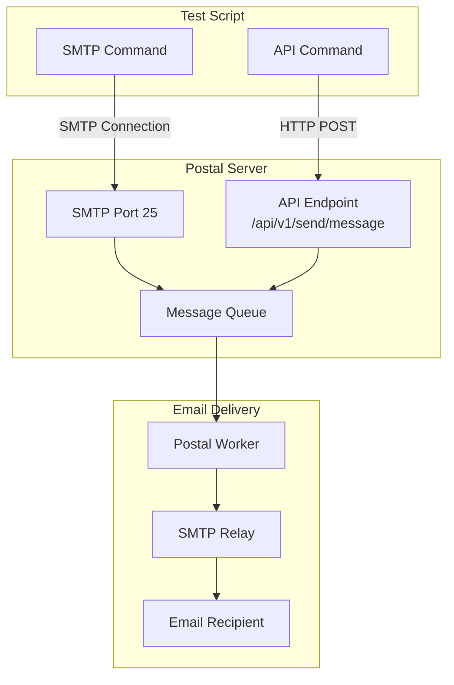
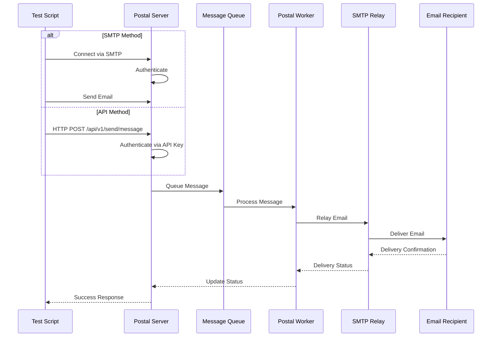
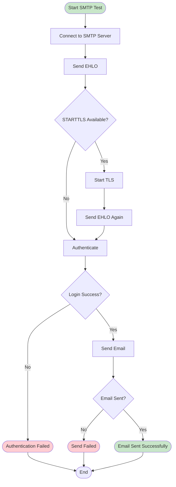
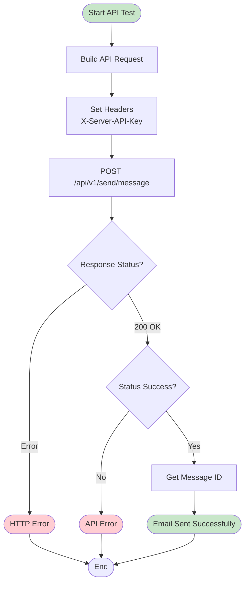

# Send Test Email Guide

This guide covers using the `send_test_email.py` script to test email delivery through Postal via SMTP or API.

## Overview

The `send_test_email.py` script provides two methods to send test emails:
1. **SMTP**: Direct SMTP connection to Postal server
2. **API**: HTTP API call to Postal server

## Prerequisites

Before using the test email script, ensure you have:

1. **Postal Installed**: Postal server must be installed and running
2. **SMTP Credentials**: Username and password from Postal web UI
3. **API Key** (for API method): API credential from Postal web UI
4. **Python Dependencies**: `typer`, `rich`, `requests` (for API method)

## Architecture



## Email Sending Flow



## SMTP Method

### Usage

```bash
uv run --with typer --with rich \
  src/gishant_scripts/postal/send_test_email.py smtp \
  --host "postal.example.com" \
  --port 25 \
  --username "postal-smtp" \
  --password "your-smtp-password" \
  --sender "sender@example.com" \
  --recipient "recipient@example.com" \
  --subject "Test Email Subject" \
  --body "Test email body content"
```

### Parameters

- `--host`: Postal SMTP hostname (default: `postal.example.com`)
- `--port`: Postal SMTP port (default: `25`)
- `--username`: SMTP username from Postal (prompted if not provided)
- `--password`: SMTP password from Postal (prompted, hidden input)
- `--sender`: From email address (prompted if not provided)
- `--recipient`: To email address (prompted if not provided)
- `--subject`: Email subject (default: "Postal Test Email (SMTP)")
- `--body`: Email body text (default: "This is a test email sent via Postal SMTP.")

### Example

```bash
# Basic usage (will prompt for credentials)
uv run --with typer --with rich \
  src/gishant_scripts/postal/send_test_email.py smtp

# Full command with all parameters
uv run --with typer --with rich \
  src/gishant_scripts/postal/send_test_email.py smtp \
  --host "mail.yourdomain.com" \
  --port 25 \
  --username "postal-smtp" \
  --password "vqR5XKvBgrQbNnj5XdtUntmx" \
  --sender "test@yourdomain.com" \
  --recipient "recipient@example.com" \
  --subject "Test Email from Postal" \
  --body "This is a test email to verify Postal is working correctly."
```

### SMTP Connection Flow



## API Method

### Usage

```bash
uv run --with typer --with rich --with requests \
  src/gishant_scripts/postal/send_test_email.py api \
  --host "postal.example.com" \
  --api-key "your-api-key" \
  --sender "sender@example.com" \
  --recipient "recipient@example.com" \
  --subject "Test Email Subject" \
  --body "Test email body content"
```

### Parameters

- `--host`: Postal hostname (default: `postal.example.com`)
- `--api-key`: Postal API key/credential (prompted if not provided, hidden input)
- `--sender`: From email address (prompted if not provided)
- `--recipient`: To email address (prompted if not provided)
- `--subject`: Email subject (default: "Postal Test Email (API)")
- `--body`: Email body text (default: "This is a test email sent via Postal API.")

### Example

```bash
# Basic usage (will prompt for API key)
uv run --with typer --with rich --with requests \
  src/gishant_scripts/postal/send_test_email.py api

# Full command with all parameters
uv run --with typer --with rich --with requests \
  src/gishant_scripts/postal/send_test_email.py api \
  --host "mail.yourdomain.com" \
  --api-key "your-api-credential-key" \
  --sender "test@yourdomain.com" \
  --recipient "recipient@example.com" \
  --subject "Test Email via API" \
  --body "This is a test email sent via Postal API."
```

### API Request Flow



## Getting Credentials

### SMTP Credentials

1. Log in to Postal web UI: `https://your-postal-domain`
2. Navigate to your organization
3. Go to "Mail Servers"
4. Select your mail server
5. Go to "Credentials" tab
6. Create a new SMTP credential
7. Copy the username and password

### API Credentials

1. Log in to Postal web UI: `https://your-postal-domain`
2. Navigate to your organization
3. Go to "Mail Servers"
4. Select your mail server
5. Go to "Credentials" tab
6. Create a new API credential
7. Copy the API key

## Testing Scenarios

### Scenario 1: Basic SMTP Test

Test basic email delivery through Postal:

```bash
uv run --with typer --with rich \
  src/gishant_scripts/postal/send_test_email.py smtp \
  --host "postal.example.com" \
  --username "postal-smtp" \
  --password "your-password" \
  --sender "test@example.com" \
  --recipient "your.email@gmail.com"
```

### Scenario 2: API Test

Test email delivery via API:

```bash
uv run --with typer --with rich --with requests \
  src/gishant_scripts/postal/send_test_email.py api \
  --host "postal.example.com" \
  --api-key "your-api-key" \
  --sender "test@example.com" \
  --recipient "your.email@gmail.com"
```

### Scenario 3: Custom Subject and Body

Send email with custom content:

```bash
uv run --with typer --with rich \
  src/gishant_scripts/postal/send_test_email.py smtp \
  --host "postal.example.com" \
  --username "postal-smtp" \
  --password "your-password" \
  --sender "test@example.com" \
  --recipient "your.email@gmail.com" \
  --subject "Custom Test Subject" \
  --body "This is a custom test email with specific content."
```

## Troubleshooting

### Issue: SMTP Authentication Failed

**Symptoms**: "Authentication failed" error

**Solutions**:
1. Verify username and password are correct
2. Check credentials in Postal web UI
3. Ensure SMTP credential is enabled
4. Check Postal SMTP server is running: `docker logs postal-web-1`

### Issue: Connection Refused

**Symptoms**: "Connection refused" or "Connection timeout"

**Solutions**:
1. Verify Postal is running: `sudo postal status`
2. Check SMTP port is accessible: `telnet postal.example.com 25`
3. Verify hostname is correct
4. Check firewall rules (port 25 should be open)

### Issue: STARTTLS Errors

**Symptoms**: TLS handshake failures

**Solutions**:
1. Postal may require STARTTLS - script handles this automatically
2. Check Postal SMTP configuration
3. Verify TLS certificates if using custom certificates

### Issue: API Returns Error

**Symptoms**: HTTP error or API returns error status

**Solutions**:
1. Verify API key is correct
2. Check API credential is enabled in Postal
3. Verify hostname is correct (should be accessible via HTTPS)
4. Check Postal web server logs: `docker logs postal-web-1`
5. For self-signed certificates, script uses `verify=False` (warning is expected)

### Issue: Email Not Delivering

**Symptoms**: Script reports success but email not received

**Solutions**:
1. Check Postal worker logs: `docker logs postal-worker-1 --tail 50`
2. Verify SMTP relay is configured
3. Check suppression list (recipient may be suppressed)
4. Verify recipient email address is correct
5. Check spam folder
6. For testing setup, verify Postfix is running and configured

## Verification

After sending a test email:

1. **Check Postal Logs**:
```bash
# Worker logs
docker logs postal-worker-1 --tail 50

# Web server logs
docker logs postal-web-1 --tail 50
```

2. **Check Email Queue**:
```bash
# Access Postal console
sudo postal console

# Check messages
Server.first.message_db.messages.last
```

3. **Check Delivery Status**:
   - Log in to Postal web UI
   - Navigate to "Messages"
   - Find your test email
   - Check delivery status

## Best Practices

1. **Use Test Email Addresses**: Use dedicated test email addresses
2. **Check Spam Folder**: Test emails may end up in spam
3. **Monitor Logs**: Always check logs after sending test emails
4. **Verify Relay**: Ensure SMTP relay is properly configured
5. **Clean Suppression List**: Remove test addresses from suppression list if needed

## Quick Reference

```bash
# SMTP method
uv run --with typer --with rich \
  src/gishant_scripts/postal/send_test_email.py smtp \
  --host "postal.example.com" \
  --port 25 \
  --username "postal-smtp" \
  --password "your-password" \
  --sender "sender@example.com" \
  --recipient "recipient@example.com"

# API method
uv run --with typer --with rich --with requests \
  src/gishant_scripts/postal/send_test_email.py api \
  --host "postal.example.com" \
  --api-key "your-api-key" \
  --sender "sender@example.com" \
  --recipient "recipient@example.com"
```
