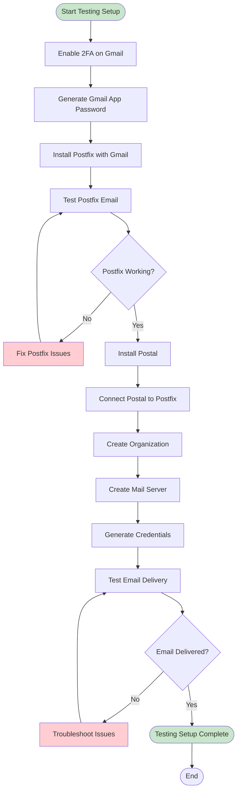
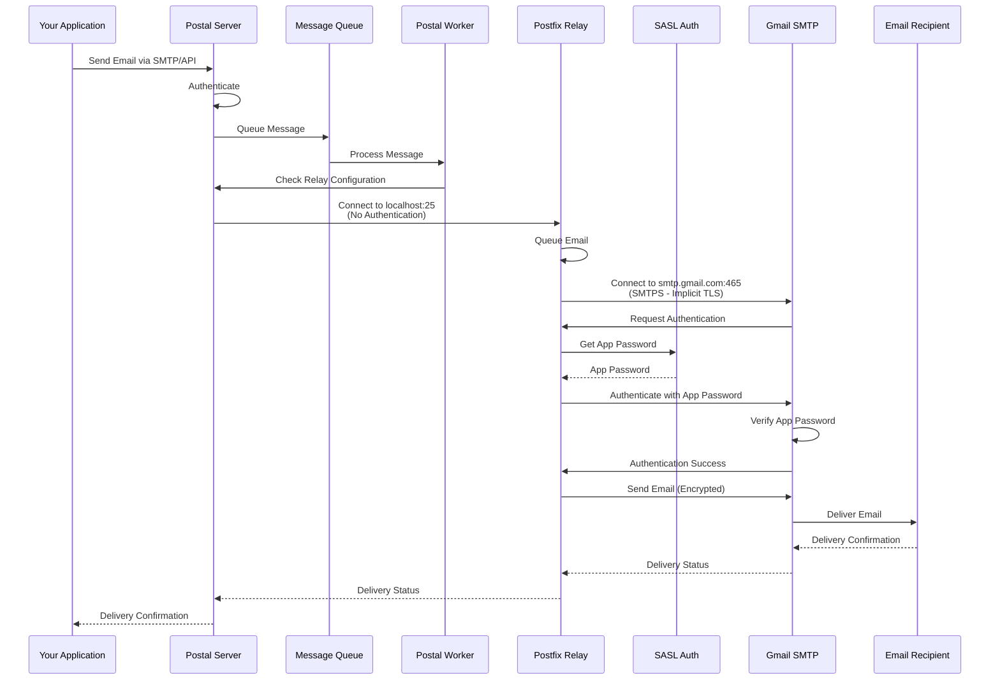

# Testing Setup Workflow - Postal with Postfix and Personal Gmail

This guide provides a complete end-to-end workflow for setting up Postal for local testing with Postfix and personal Gmail.

## Overview

This workflow covers:
1. Gmail app password generation
2. Postfix installation and configuration
3. Postal installation
4. Connecting Postal to Postfix
5. Testing email delivery
6. Troubleshooting common issues

## Complete Architecture

```mermaid
graph TB
    subgraph "Local Testing Server"
        Postal[Postal Mail Server]
        Postfix[Postfix Relay<br/>localhost:25]
        Caddy[Caddy Web Server]
        MariaDB[(MariaDB Database)]
        HostsFile[/etc/hosts<br/>postal.example.com]
    end

    subgraph "Personal Gmail"
        GmailSMTP[Gmail SMTP<br/>smtp.gmail.com:465]
        AppPassword[App Password<br/>16 Characters]
        TwoFA[2FA Enabled]
    end

    subgraph "Email Flow"
        App[Your Application] -->|SMTP| Postal
        Postal -->|localhost:25<br/>No Auth| Postfix
        Postfix -->|Authenticated<br/>Port 465| GmailSMTP
        GmailSMTP -->|Deliver| Recipient[Email Recipients]
    end

    subgraph "Web Access"
        Admin[Admin User] -->|HTTPS| Caddy
        Caddy -->|Proxy| Postal
    end

    Postal --> MariaDB
    Postfix --> AppPassword
    AppPassword --> TwoFA
    HostsFile -.->|Local DNS| Postal

    classDef local fill:#e8f5e9,stroke:#2e7d32;
    classDef external fill:#fff3e0,stroke:#f57c00;
```

## Complete Workflow



## Step-by-Step Workflow

### Step 1: Prepare Gmail Account

#### 1.1 Enable 2-Step Verification

1. Go to https://myaccount.google.com/security
2. Find "2-Step Verification"
3. Click "Get Started" or "Turn On"
4. Follow the setup wizard
5. Complete verification

#### 1.2 Generate App Password

1. Go to https://myaccount.google.com/apppasswords
2. Select "Mail" as the app
3. Select "Other (Custom name)" as the device
4. Enter a name (e.g., "Postfix Relay")
5. Click "Generate"
6. **Copy the 16-character password** (spaces can be included or removed)

**Important**: Save this password securely. You won't be able to see it again.

**Example App Password Format**: `uraf ipla cfws ukmn` (16 characters with or without spaces)

### Step 2: Install Postfix

#### 2.1 Run Installation Script

```bash
uv run --with typer --with rich \
  src/gishant_scripts/postal/install_postfix.py main \
  --gmail-address "your.email@gmail.com" \
  --app-password "your-16-char-app-password" \
  --relay-host "smtp.gmail.com" \
  --relay-port 465 \
  --test-recipient "your.email@gmail.com"
```

**Parameters:**
- `--gmail-address`: Your Gmail email address
- `--app-password`: The 16-character app password from Step 1.2
- `--relay-host`: Gmail SMTP hostname (default: `smtp.gmail.com`)
- `--relay-port`: Port 465 (SMTPS) or 587 (STARTTLS) - default: 465
- `--test-recipient`: Email to send test email to
- `--skip-test`: Skip sending test email

**What this does:**
- Installs Postfix, sasl2-bin, libsasl2-modules
- Creates `/etc/postfix/sasl_passwd` with Gmail credentials
- Configures `/etc/postfix/main.cf` for Gmail relay
- Sets up TLS/SSL for port 465
- Restarts Postfix service
- Sends test email (if recipient provided)

#### 2.2 Verify Postfix Installation

```bash
# Check Postfix status
uv run --with typer --with rich \
  src/gishant_scripts/postal/install_postfix.py status

# Show configuration (passwords masked)
uv run --with typer --with rich \
  src/gishant_scripts/postal/install_postfix.py show-config
```

**Expected Output:**
- Postfix service running
- Configuration valid
- SASL password file exists

#### 2.3 Test Postfix Directly

```bash
# Send test email through Postfix
uv run --with typer --with rich \
  src/gishant_scripts/postal/install_postfix.py test \
  --recipient "your.email@gmail.com" \
  --subject "Postfix Test Email" \
  --sender "your.email@gmail.com"
```

**Verify:**
- Check recipient's inbox (and spam folder)
- Check Postfix logs: `sudo tail -f /var/log/mail.log`

### Step 3: Install Postal

#### 3.1 Run Installation Script

```bash
uv run --with typer --with rich --with pyyaml \
  src/gishant_scripts/postal/install_postal.py main \
  --domain "postal.example.com" \
  --db-password "postal" \
  --admin-email "admin@example.com" \
  --admin-password "admin123"
```

**Parameters:**
- `--domain`: Domain for Postal (use `postal.example.com` for local testing)
- `--db-password`: Database password (use simple password for testing)
- `--admin-email`: Admin email address
- `--admin-password`: Admin password
- `--skip-user-creation`: Skip admin user creation (if user exists)

**What this does:**
- Installs Docker and Docker Compose
- Sets up Postal repository
- Configures MariaDB database
- Bootstraps Postal configuration
- Sets up Caddy web server
- Initializes Postal database
- Creates admin user
- Starts all services
- Adds `postal.example.com` to `/etc/hosts`

#### 3.2 Verify Postal Installation

```bash
# Check Postal status
sudo postal status

# Check configuration
uv run --with typer --with rich --with pyyaml \
  src/gishant_scripts/postal/install_postal.py show-config

# Check Docker containers
docker ps
```

**Expected Output:**
- Postal services running
- Web UI accessible at `https://postal.example.com`
- Configuration valid

### Step 4: Connect Postal to Postfix

#### 4.1 Add Postfix Relay

```bash
uv run --with typer --with rich --with pyyaml \
  src/gishant_scripts/postal/install_postal.py add-postfix-relay
```

**What this does:**
- Checks if Postfix is running
- Tests connectivity to Postfix (localhost:25)
- Adds `smtp://127.0.0.1:25?ssl_mode=none` to Postal configuration
- Restarts Postal

#### 4.2 Verify Connection

```bash
# Check Postal configuration includes Postfix relay
uv run --with typer --with rich --with pyyaml \
  src/gishant_scripts/postal/install_postal.py show-config
```

**Expected Output:**
- Relay configured: `smtp://127.0.0.1:25?ssl_mode=none`

### Step 5: Create Organization and Mail Server

#### 5.1 Access Postal Web UI

1. Navigate to `https://postal.example.com`
2. Accept self-signed certificate warning
3. Log in with admin credentials

#### 5.2 Create Organization

1. Click "Create Organization"
2. Enter organization name (e.g., "Test Organization")
3. Save

#### 5.3 Create Mail Server

1. Navigate to your organization
2. Click "Create Mail Server"
3. Enter server details:
   - **Hostname**: `postal.example.com` (or your domain)
   - **Domain**: `example.com` (or your domain)
4. Save

#### 5.4 Generate Credentials

1. Navigate to your mail server
2. Go to "Credentials" tab
3. Create SMTP credential:
   - Click "Create SMTP Credential"
   - Copy username and password
4. Create API credential (optional):
   - Click "Create API Credential"
   - Copy API key

### Step 6: Test Email Delivery

#### 6.1 Test via SMTP

```bash
uv run --with typer --with rich --with requests \
  src/gishant_scripts/postal/send_test_email.py smtp \
  --host "postal.example.com" \
  --port 25 \
  --username "your-smtp-username" \
  --password "your-smtp-password" \
  --sender "your.email@gmail.com" \
  --recipient "your.email@gmail.com" \
  --subject "Testing Workflow Test Email" \
  --body "This is a test email from the complete testing workflow."
```

#### 6.2 Test via API

```bash
uv run --with typer --with rich --with requests \
  src/gishant_scripts/postal/send_test_email.py api \
  --host "postal.example.com" \
  --api-key "your-api-key" \
  --sender "your.email@gmail.com" \
  --recipient "your.email@gmail.com" \
  --subject "Testing Workflow Test Email via API"
```

#### 6.3 Verify Delivery

1. **Check Recipient's Inbox**: Look for test email (check spam folder too)
2. **Check Postal Web UI**: Navigate to Messages section
3. **Check Delivery Status**: Verify email was delivered
4. **Check Logs**:
   ```bash
   # Postal worker logs
   docker logs postal-worker-1 --tail 50

   # Postfix logs
   sudo tail -f /var/log/mail.log
   ```

## Email Delivery Flow



## Troubleshooting

### Issue: Gmail App Password Not Working

**Symptoms**: Authentication failures, "invalid credentials"

**Solutions**:
1. Verify 2FA is enabled on Gmail account
2. Regenerate app password if needed
3. Check app password is exactly 16 characters
4. Verify app password in `/etc/postfix/sasl_passwd`: `sudo cat /etc/postfix/sasl_passwd`
5. Recreate password map: `sudo postmap /etc/postfix/sasl_passwd`
6. Restart Postfix: `sudo systemctl restart postfix`

### Issue: Postfix Not Running

**Symptoms**: Cannot connect to Postfix, service not found

**Solutions**:
1. Check Postfix status: `sudo systemctl status postfix`
2. Start Postfix: `sudo systemctl start postfix`
3. Enable Postfix: `sudo systemctl enable postfix`
4. Check Postfix logs: `sudo journalctl -u postfix -f`

### Issue: Postal Cannot Connect to Postfix

**Symptoms**: "No SMTP servers were available" errors

**Solutions**:
1. Verify Postfix is running: `sudo systemctl status postfix`
2. Test connectivity: `telnet 127.0.0.1 25`
3. Check if relay is configured: `install_postal.py show-config`
4. Verify Postfix is listening: `sudo netstat -tlnp | grep 25`
5. Re-add relay: `install_postal.py add-postfix-relay`

### Issue: Emails Stuck in Queue

**Symptoms**: Emails not sending, stuck in Postal or Postfix queue

**Solutions**:
1. **Postal Queue**:
   ```bash
   sudo postal console
   Server.first.message_db.messages.where(status: 'queued').count
   ```
2. **Postfix Queue**:
   ```bash
   sudo postqueue -p
   sudo postqueue -f  # Flush queue
   ```
3. Check logs for errors:
   ```bash
   docker logs postal-worker-1 --tail 50
   sudo tail -f /var/log/mail.log
   ```

### Issue: Suppression List Blocking Emails

**Symptoms**: "recipient is on suppression list" errors

**Solutions**:
1. Access Postal console: `sudo postal console`
2. Remove from suppression list:
   ```ruby
   server = Server.first
   server.message_db.suppression_list.remove("recipient", "email@example.com")
   ```
3. Or use SQL:
   ```bash
   sudo postal console
   # Then in console:
   server = Server.first
   server.message_db.query("DELETE FROM suppressions WHERE address = 'email@example.com'")
   ```

### Issue: Emails Marked as Spam

**Symptoms**: Emails delivered but in spam folder

**Solutions**:
1. This is expected for testing without proper DNS setup
2. Check recipient's spam folder
3. For better deliverability, configure SPF, DKIM, DMARC records
4. Use a proper domain instead of `postal.example.com`

### Issue: Gmail Rate Limits

**Symptoms**: Emails not sending, rate limit errors

**Solutions**:
1. Gmail free accounts have daily sending limits (500 emails/day)
2. Wait before retrying
3. Check Gmail account status
4. Consider using Gmail Workspace for higher limits

## Verification Checklist

- [ ] Gmail 2FA enabled
- [ ] Gmail app password generated
- [ ] Postfix installed and running
- [ ] Postfix test email delivered
- [ ] Postal installed and running
- [ ] Postal web UI accessible
- [ ] Postal connected to Postfix relay
- [ ] Organization created in Postal
- [ ] Mail server created in Postal
- [ ] SMTP credentials generated
- [ ] Test email sent via Postal
- [ ] Test email received in inbox

## Quick Reference

```bash
# Step 1: Install Postfix
uv run src/gishant_scripts/postal/install_postfix.py main \
  --gmail-address "your.email@gmail.com" \
  --app-password "your-app-password" \
  --test-recipient "your.email@gmail.com"

# Step 2: Install Postal
uv run src/gishant_scripts/postal/install_postal.py main \
  --domain "postal.example.com" \
  --db-password "postal" \
  --admin-email "admin@example.com" \
  --admin-password "admin123"

# Step 3: Connect Postal to Postfix
uv run src/gishant_scripts/postal/install_postal.py add-postfix-relay

# Step 4: Test email
uv run src/gishant_scripts/postal/send_test_email.py smtp \
  --host "postal.example.com" \
  --port 25 \
  --username "smtp-username" \
  --password "smtp-password" \
  --sender "your.email@gmail.com" \
  --recipient "your.email@gmail.com"

# Check status
uv run src/gishant_scripts/postal/install_postal.py show-config
uv run src/gishant_scripts/postal/install_postfix.py status
```

## Next Steps

After completing this workflow:

1. **Test Different Scenarios**: Test various email types and formats
2. **Integrate with Application**: Use Postal in your application
3. **Monitor Performance**: Check logs and delivery rates
4. **Consider Production Setup**: See [Production Workflow Guide](PRODUCTION_WORKFLOW.md) for production deployment
5. **Configure DNS**: For better deliverability, configure proper DNS records

## Limitations of Testing Setup

1. **No Proper DNS**: Emails may be marked as spam
2. **Personal Gmail Limits**: 500 emails/day for free accounts
3. **Local Domain**: Using `postal.example.com` is only for local testing
4. **No SPF/DKIM**: Without proper DNS, email authentication fails
5. **Self-Signed Certificates**: Browser warnings for web UI

## Maintenance

### Regular Tasks

1. **Monitor Logs**: Check logs for errors
2. **Test Email Delivery**: Regularly test email sending
3. **Update App Password**: If app password is compromised
4. **Clean Suppression List**: Remove test addresses if needed
5. **Update Software**: Keep Postal and Postfix updated

### Update App Password

If you need to update the Gmail app password:

1. Generate new app password from Google Account
2. Edit `/etc/postfix/sasl_passwd`:
   ```bash
   sudo nano /etc/postfix/sasl_passwd
   ```
3. Update the password
4. Recreate map: `sudo postmap /etc/postfix/sasl_passwd`
5. Reload Postfix: `sudo systemctl reload postfix`

### Backup Configuration

```bash
# Backup Postfix configuration
sudo cp /etc/postfix/main.cf ~/postfix_main_cf_backup
sudo cp /etc/postfix/sasl_passwd ~/sasl_passwd_backup
sudo chmod 600 ~/sasl_passwd_backup

# Backup Postal database
sudo mysqldump -u postal -p postal > postal_backup_$(date +%Y%m%d).sql
```
